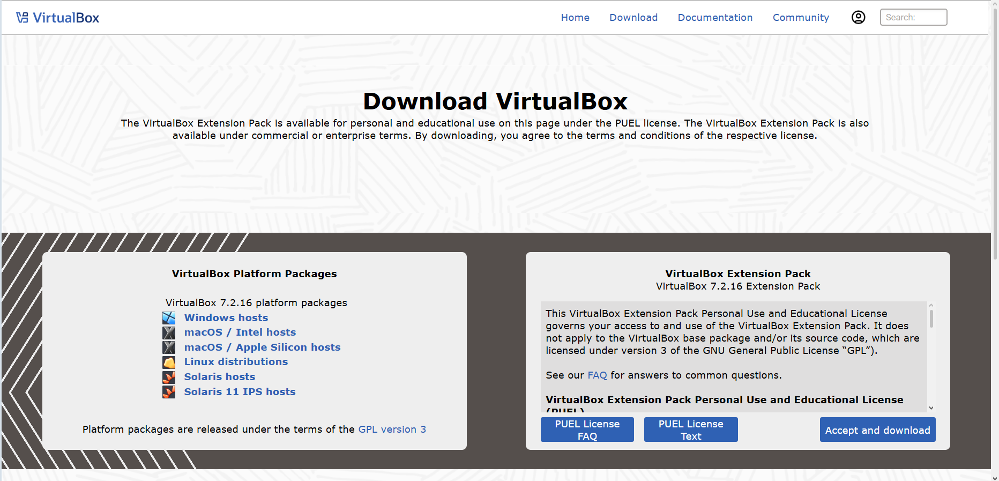
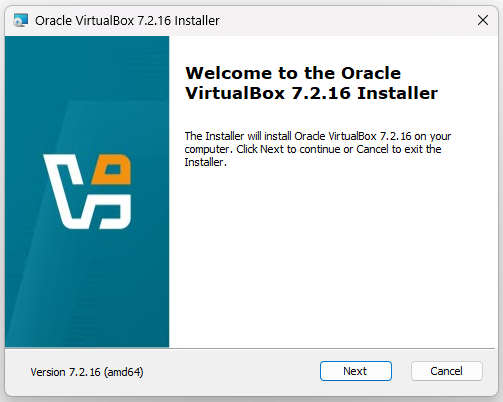
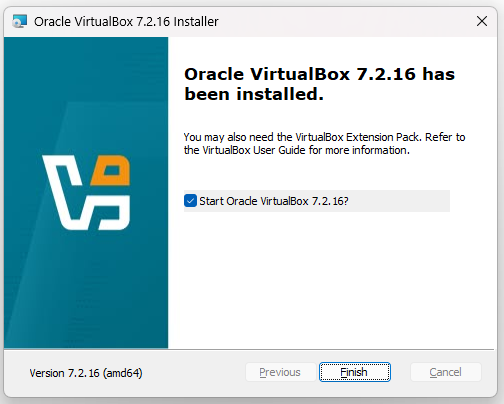

# Installing Oracle VirtualBox

## Introduction

Oracle VirtualBox is used as the hypervisor for the TechLab365 Windows Server and Active Directory laboratory.

VirtualBox provides the virtualisation platform required to create and run the Windows Server 2025 domain controller and Windows 11 Pro client used throughout this repository.

In this chapter, Oracle VirtualBox 7.2.16 was downloaded and installed on the Windows host computer. The VirtualBox Manager was then opened to verify that the installation completed successfully.

---

# Objectives

After completing this chapter, I will be able to:

- Download Oracle VirtualBox 7.2.16 for Windows.
- Install Oracle VirtualBox using the standard installation options.
- Verify that the installation completed successfully.
- Open and access Oracle VirtualBox Manager.
- Prepare the virtualisation environment for the Windows Server and Windows 11 laboratory.

---

# Prerequisites

Before starting this chapter, ensure you have:

- A Windows host computer.
- Administrator permissions.
- Internet access.
- Sufficient storage space for the virtual machines used in the laboratory.

---

# Downloading Oracle VirtualBox

The Oracle VirtualBox download page was accessed and the **Windows hosts** package for **VirtualBox 7.2.16** was selected.

The Windows installer was downloaded to the host computer.

> **Note**
>
> The download page screenshot was captured using the Wayback Machine because the current VirtualBox website was not loading correctly in the browser at the time of documentation.

---

# Starting the Installation

The downloaded VirtualBox installer was opened.

The installer confirmed that **Oracle VirtualBox 7.2.16** would be installed on the Windows host.

The installation was continued using the standard installation options.

---

# Completing the Installation

After the installation process completed, the installer displayed a confirmation that **Oracle VirtualBox 7.2.16 has been installed**.

This confirmed that the VirtualBox installation was successful.

---

# Opening VirtualBox Manager

After completing the installation, Oracle VirtualBox Manager was opened.

The main VirtualBox Manager interface was displayed successfully and was ready to create and manage virtual machines.

At this stage, no virtual machines had been created. The virtual machines required for the Windows Server and Active Directory laboratory will be created in the following chapters.

---

# Verification

The installation was verified by confirming that:

- Oracle VirtualBox 7.2.16 was successfully installed.
- The installation completed without errors.
- Oracle VirtualBox Manager opened successfully.
- The VirtualBox Manager interface was available for creating virtual machines.

---

# Key Learnings

- Oracle VirtualBox provides the virtualisation platform for this laboratory.
- VirtualBox 7.2.16 was installed on the Windows host computer.
- The VirtualBox Manager provides the interface used to create and manage virtual machines.
- The virtualisation environment must be prepared before installing Windows Server 2025 and Windows 11 Pro.

---

# Skills Demonstrated

- Installing desktop virtualisation software.
- Verifying software installation.
- Navigating Oracle VirtualBox Manager.
- Preparing a virtualisation environment.
- Producing technical documentation using GitHub and Markdown.

---

# Interview Tip

Virtualisation is commonly used in IT support, infrastructure and system administration environments.

For junior IT Support roles, it is useful to understand that a hypervisor such as VirtualBox can be used to create isolated virtual machines for testing operating systems, networking configurations and server technologies.

---

# Chapter Summary

In this chapter, Oracle VirtualBox 7.2.16 was downloaded and installed successfully on the Windows host computer.

The installation was verified by opening Oracle VirtualBox Manager and confirming that the management interface was available.

The virtualisation environment is now ready for the next stage of the laboratory.

---

# Next Chapter

Continue directly to:

**[Chapter 2 – Installing Windows Server 2025](../02-Installing-Windows-Server/Installing-Windows-Server.md)**

This link allows the reader to continue to the next chapter without returning to the repository folder structure.