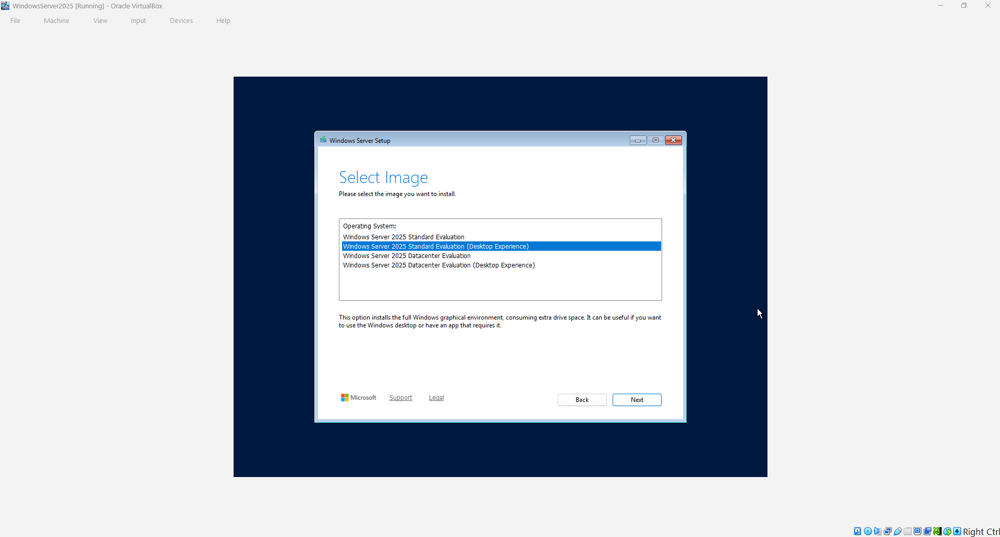
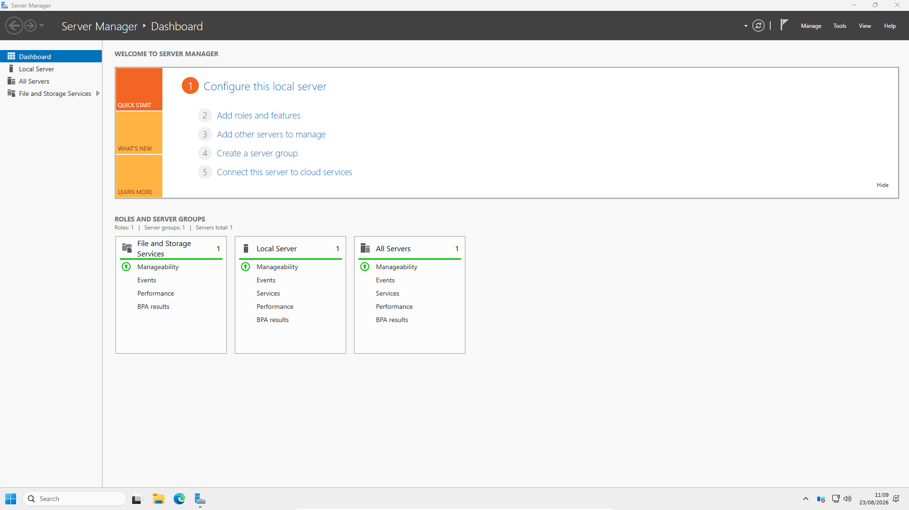

# Installing Windows Server 2025

## Introduction

Windows Server 2025 is the server operating system used as the foundation of the TechLab365 Windows Server and Active Directory laboratory.

The server was installed as a virtual machine using Oracle VirtualBox 7.2.16. The objective of this chapter is not simply to install the operating system, but to document the complete process used to create a repeatable Windows Server environment that can later be configured as the Active Directory domain controller.

For this laboratory, **Windows Server 2025 Standard Evaluation with Desktop Experience** was selected. The Desktop Experience provides the graphical administration environment required for the practical work that follows in this repository.

The installation was performed manually rather than using VirtualBox unattended installation. This is important because the laboratory is intended to reproduce the type of administration tasks that an IT administrator would normally perform when building a server environment.

---

# Objectives

After completing this chapter, I will be able to:

- Create a Windows Server 2025 virtual machine in Oracle VirtualBox.
- Configure the virtual hardware required by the laboratory.
- Perform a manual Windows Server 2025 installation.
- Select the appropriate Windows Server edition.
- Configure the local Administrator account.
- Install Oracle VirtualBox Guest Additions.
- Configure the virtual machine for a practical administration environment.
- Verify that Windows Server is installed and operational.

---

# Prerequisites

Before starting this chapter, ensure you have:

- Oracle VirtualBox 7.2.16 installed.
- Administrator permissions on the Windows host.
- The Windows Server 2025 Evaluation ISO.
- Sufficient host storage for the virtual machine.
- Sufficient system memory to run the Windows Server virtual machine.

The VirtualBox installation is documented in **Chapter 1 – Installing Oracle VirtualBox**.

---

# Lab Configuration

The Windows Server virtual machine was created with the following configuration:

| Component | Configuration |
|---|---|
| Hypervisor | Oracle VirtualBox 7.2.16 |
| VM Name | `WindowsServer2025` |
| Operating System | Windows Server 2025 (64-bit) |
| Edition | Standard Evaluation |
| Installation | Desktop Experience |
| Memory | 4096 MB |
| Processors | 2 |
| EFI | Disabled |
| Virtual Disk | 60 GB |
| Disk Format | VDI |
| Disk Allocation | Dynamically allocated |
| Installation Method | Manual |
| Unattended Installation | Disabled |

The VM name **WindowsServer2025** was used without spaces. This also provides a simple and consistent name for identifying the virtual machine throughout the laboratory.

---

# Creating the Windows Server Virtual Machine

The Windows Server virtual machine was created from Oracle VirtualBox Manager using **New**.

The virtual machine was configured for a 64-bit Windows Server 2025 operating system and assigned 4 GB of memory and two virtual processors. A 60 GB VDI virtual hard disk was created for the operating system.

The virtual machine was configured to use the Windows Server 2025 ISO as its optical installation media.

## Manual Installation

VirtualBox 7.2.16 provides an option to configure an unattended guest operating-system installation. This option was **not used** for this laboratory.

The **Proceed with Unattended Installation** option was left disabled.

This means that Windows Setup was allowed to run normally and the important installation decisions were made manually. This included selecting the Windows Server edition and configuring the local Administrator account.

This approach also makes the procedure easier to reproduce if the virtual machine needs to be rebuilt in the future.

---

# Starting Windows Server Setup

After the virtual machine was created, it was started with the Windows Server 2025 ISO attached.

Windows Server Setup first displayed the language configuration screen. The language settings used for the laboratory were:

- **Language to install:** English (United States)
- **Time and currency format:** English (United Kingdom)

The installation was then continued until Windows Setup displayed the available Windows Server images.

---

# Selecting the Windows Server Edition

Windows Server Setup provides several installation choices, including Standard and Datacenter editions, with and without Desktop Experience.

For this laboratory, the following image was selected:

**Windows Server 2025 Standard Evaluation (Desktop Experience)**



The **Desktop Experience** option was deliberately selected because this laboratory relies heavily on the graphical administration tools available in Windows Server.

Later chapters will use tools such as Server Manager, Active Directory Users and Computers, Group Policy Management, DNS Manager and DHCP management tools. Having the graphical environment therefore makes the laboratory easier to administer and provides a practical environment for learning and demonstration.

---

# Completing Windows Server Setup

After selecting the required edition, Windows Setup was continued using the standard installation process.

The Microsoft licence terms were accepted and the virtual disk was selected as the installation destination.

The 60 GB virtual disk created earlier was available to Windows Setup. Windows created the system partitions required for the operating system and continued with the installation.

Windows then copied the installation files and restarted the virtual machine several times.

Once installation completed, Windows Server displayed the local **Administrator** sign-in screen.

The Administrator password configured during the installation was then used to sign in to the new server.

At this point the Windows Server operating system was installed, but the server had not yet been configured as a domain controller. Active Directory Domain Services is deliberately left for a later chapter.

---

# Installing Oracle VirtualBox Guest Additions

After the first successful Windows Server sign-in, Oracle VirtualBox Guest Additions were installed.

Guest Additions are useful in this laboratory because they improve the integration between the Windows Server guest and the Windows host. In particular, they provide improved display handling and allow the virtual machine display to work more effectively when changing the VirtualBox window size or using full-screen mode.

The installation was started from the VirtualBox menu:

**Devices → Insert Guest Additions CD Image…**

The Guest Additions ISO was then mounted inside Windows Server as a virtual CD.

Inside the mounted CD, the installer was started by running:

```text
VBoxWindowsAdditions.exe
```

The installation was completed using the standard options. Windows displayed the appropriate driver installation prompts during the process.

The virtual machine was subsequently restarted so that the Guest Additions installation could be completed.

---

# Configuring the Virtual Machine Display

After the restart, the Windows Server desktop was displayed correctly inside VirtualBox.

VirtualBox was then switched to **View → Full-screen Mode**.

This provides a more practical working environment for the administration tasks performed later in the laboratory.

The display configuration is not an Active Directory requirement; it is a usability configuration that makes the virtual server easier to work with during the remaining chapters.

---

# Verifying the Windows Server Installation

After Windows Server restarted, **Server Manager** opened successfully and displayed the Windows Server Dashboard.



The Server Manager Dashboard provides the starting point for managing the server and confirms that the Windows Server installation is operational.

The dashboard also provides access to the server management functions that will be used in subsequent chapters.

At this stage, the server remains a standalone Windows Server installation. No Active Directory Domain Services role has been installed yet.

---

# Verification

The installation was considered successful after verifying that:

- Windows Server 2025 starts correctly.
- The Standard Evaluation edition with Desktop Experience is installed.
- The local Administrator account can sign in.
- Server Manager opens successfully.
- The virtual machine has the intended 4 GB memory allocation.
- The virtual machine has two processors.
- The virtual hard disk is 60 GB.
- Oracle VirtualBox Guest Additions are installed.
- The Windows Server display can be used in full-screen mode.

---

# Key Learnings

During this chapter, I learned that:

- A Windows Server environment can be built safely inside a virtual machine without affecting the host operating system.
- Virtual machine hardware must be planned before installing the server operating system.
- Windows Server provides different installation images and the correct edition must be selected according to the intended use.
- **Desktop Experience** provides the graphical administration environment required for this laboratory.
- A manual installation provides greater control over the initial server configuration than an unattended installation.
- VirtualBox Guest Additions improve the usability and integration of the guest operating system.
- Server Manager provides the initial administration interface once Windows Server has been installed.

---

# Skills Demonstrated

During this chapter, I demonstrated practical experience in:

- Creating a Windows Server virtual machine.
- Configuring virtual hardware.
- Installing Windows Server 2025.
- Selecting and installing the appropriate Windows Server edition.
- Performing a manual server installation.
- Configuring a local Administrator account.
- Installing VirtualBox Guest Additions.
- Verifying a Windows Server installation.
- Preparing a server environment for Active Directory administration.
- Producing technical documentation using GitHub and Markdown.

---

# Interview Tip

For a First Line or IT Support role, Windows Server installation is useful background knowledge because many business environments depend on Windows Server for services such as Active Directory, DNS, DHCP and file services.

A useful way to describe this laboratory experience in an interview is:

> “I built a Windows Server 2025 environment in VirtualBox from scratch. I configured the virtual hardware, performed a manual installation using the Desktop Experience, installed Guest Additions and verified the server before moving on to Active Directory configuration.”

This demonstrates that the experience is based on a **hands-on laboratory rather than only theoretical study**.

---

# Chapter Summary

In this chapter, I created and installed a Windows Server 2025 virtual machine using Oracle VirtualBox 7.2.16.

The server was configured with 4 GB of memory, two processors and a 60 GB dynamically allocated virtual disk. Windows Server 2025 Standard Evaluation with Desktop Experience was installed manually, allowing the installation decisions and local Administrator configuration to be performed directly.

Following the installation, Oracle VirtualBox Guest Additions were installed and the virtual machine was configured for full-screen use. Server Manager was then used to verify that the Windows Server environment was operational.

The server is now ready for the next stage of the laboratory: preparing Windows Server for its future role as the Active Directory domain controller.

---

# Next Chapter

Continue directly to:

**[Chapter 3 – Preparing Windows Server](../03-Preparing-Windows-Server/Preparing-Windows-Server.md)**
