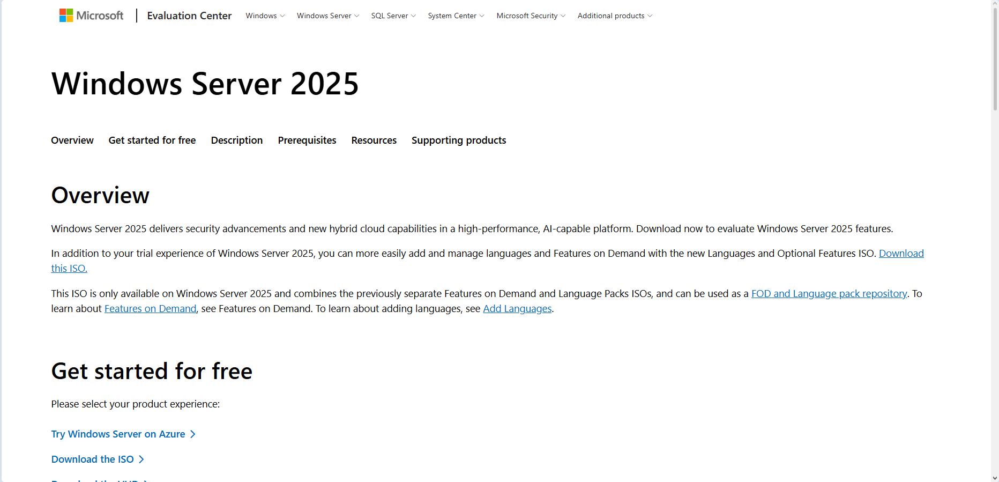

# Installing Windows Server 2025

## Purpose

This chapter documents the installation of **Windows Server 2025 Standard Evaluation (Desktop Experience)** as the server operating system for the TechLab365 Active Directory laboratory.

The installation is performed manually inside Oracle VirtualBox. The procedure is documented so that the environment can be reproduced later as both portfolio evidence and a personal technical reference.

---

## Objectives

- Create a Windows Server 2025 virtual machine.
- Configure the virtual hardware required for the laboratory.
- Perform a manual Windows Server 2025 installation.
- Install the Desktop Experience.
- Configure the local Administrator account.
- Install Oracle VirtualBox Guest Additions.
- Verify that Windows Server is installed and operational.

---

## Environment

| Component | Configuration |
|---|---|
| Hypervisor | Oracle VirtualBox 7.2.16 |
| VM Name | `WindowsServer2025` |
| Operating System | Windows Server 2025 |
| Edition | Standard Evaluation |
| Installation option | Desktop Experience |
| Memory | 4096 MB |
| Processors | 2 |
| Firmware | BIOS |
| Virtual Disk | 60 GB |
| Disk Format | VDI |
| Disk Allocation | Dynamically allocated |
| Installation Method | Manual |
| Unattended Installation | Disabled |

---

## 1. Download Windows Server 2025

Windows Server 2025 was obtained from the Microsoft Evaluation Center.

The Windows Server 2025 ISO was used as the installation media for the virtual machine.

---

## 2. Create the Virtual Machine

In Oracle VirtualBox, create a new virtual machine with the following configuration:

- **VM Name:** `WindowsServer2025`
- **Operating System:** Microsoft Windows
- **OS Version:** Windows Server 2025 (64-bit)
- **Memory:** 4096 MB
- **Processors:** 2
- **EFI:** Disabled
- **Virtual Hard Disk:** 60 GB
- **Disk Format:** VDI
- **Disk Allocation:** Dynamically allocated
- **Unattended Installation:** Disabled

### Important: Manual Installation

**Proceed with Unattended Installation must remain unchecked.**

The laboratory uses a manual Windows installation so that the Windows Server setup process, edition selection and Administrator password configuration are performed directly.

This also makes the procedure reproducible when the laboratory needs to be rebuilt.

---

## 3. Start the Windows Server Installation

Start `WindowsServer2025` from VirtualBox with the Windows Server 2025 ISO attached.

Windows Server Setup starts from the ISO.

At the language screen, the following settings were used:

- **Language to install:** English (United States)
- **Time and currency format:** English (United Kingdom)

Continue through Windows Setup until the operating-system image selection screen is displayed.

---

## 4. Select the Windows Server Edition

Select:

**Windows Server 2025 Standard Evaluation (Desktop Experience)**

### Why Desktop Experience?

Desktop Experience provides the graphical Windows Server environment required for this laboratory.

The graphical environment is particularly useful for this project because later chapters will use tools such as:

- Server Manager
- Active Directory Users and Computers
- Group Policy Management
- DNS Manager
- DHCP Manager
- File Server management tools
- Microsoft Management Console (MMC)

---

## 5. Accept the Licence Terms

Accept the applicable Microsoft software licence terms and continue with Windows Setup.

---

## 6. Select the Installation Location

Windows Server Setup displays the available virtual disk and partitions.

For this laboratory, the main virtual disk was created as a **60 GB dynamically allocated VDI**.

Select the main available installation partition and continue.

Windows Setup creates the required system configuration and installs Windows Server.

No manual formatting or deletion of the automatically created system partitions was required.

---

## 7. Complete Windows Server Installation

Windows Setup copies the installation files and restarts the virtual machine several times.

After installation completes, Windows Server displays the local **Administrator** sign-in screen.

The Administrator account password configured during setup is used to sign in.

---

## 8. Install Oracle VirtualBox Guest Additions

After Windows Server was installed, Oracle VirtualBox Guest Additions were installed to improve integration between the host and the virtual machine.

From the VirtualBox menu:

**Devices → Insert Guest Additions CD Image…**

Inside Windows Server, open the mounted Guest Additions CD and run:

`VBoxWindowsAdditions.exe`

Use the default installation options and allow the Oracle drivers to be installed when prompted.

The virtual machine was restarted to complete the Guest Additions installation.

### Purpose of Guest Additions

Guest Additions provide additional integration between the host and guest operating systems, including improved display handling and automatic resizing support.

---

## 9. Configure Full-Screen Display

After installing Guest Additions, VirtualBox was switched to:

**View → Full-screen Mode**

This provides a larger working area for the Windows Server administration tasks that follow.

---

## 10. Verify the Installation

After signing in, **Server Manager** opens and displays the Windows Server Dashboard.

The Server Manager Dashboard confirms that the Windows Server installation is operational and ready for further configuration.

At this stage, no Active Directory role has been installed yet.

Active Directory Domain Services will be configured in a later chapter.

---

## Verification

The following items were verified:

- Windows Server 2025 installed successfully.
- Windows Server Standard Evaluation was selected.
- Desktop Experience is installed.
- The local Administrator account can sign in.
- Server Manager starts successfully.
- The virtual machine has 4096 MB RAM.
- The virtual machine has 2 processors.
- The virtual machine uses a 60 GB VDI.
- Oracle VirtualBox Guest Additions were installed.
- Full-screen mode is available for the virtual machine.

---

## Key Points

- The Windows Server virtual machine was created specifically for the Active Directory laboratory.
- The installation was performed manually rather than using VirtualBox unattended installation.
- Windows Server 2025 Standard Evaluation with Desktop Experience was selected.
- The VM uses 4 GB RAM, 2 processors and a 60 GB dynamically allocated VDI.
- Guest Additions were installed after Windows Server.
- The server is currently a standalone Windows Server installation.
- Active Directory Domain Services has **not** yet been installed.

---

## Learning Outcome

This chapter provided practical experience with:

- Creating a Windows Server virtual machine.
- Configuring virtual hardware.
- Installing Windows Server 2025.
- Selecting the appropriate Windows Server edition.
- Performing a manual server installation.
- Installing VirtualBox Guest Additions.
- Verifying a completed Windows Server installation.

The resulting server provides the foundation for the Active Directory environment developed in the following chapters.

---

## Interview Tip

For a Service Desk or First Line IT Support role, being able to explain how a Windows Server virtual machine was created and installed demonstrates familiarity with the underlying infrastructure that supports Active Directory environments.

A useful interview explanation would be:

> "I built a Windows Server 2025 virtual laboratory from scratch using VirtualBox. I installed the Desktop Experience manually, configured the server VM, installed Guest Additions and verified the installation before deploying Active Directory Domain Services."

---

## Next Chapter

➡️ **[Preparing Windows Server](../Preparing-Windows-Server/Preparing-Windows-Server.md)**
