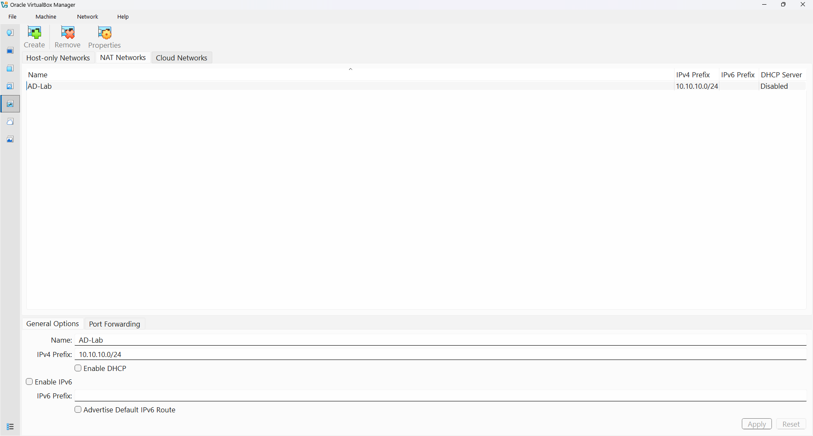
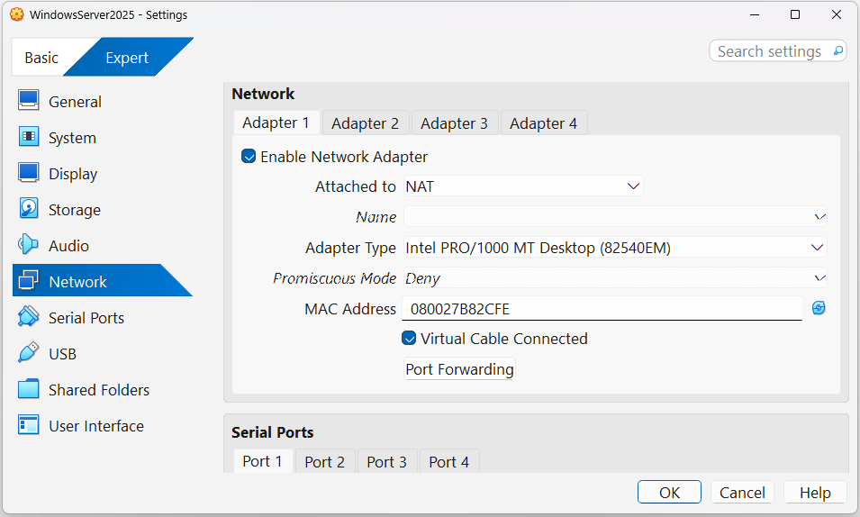
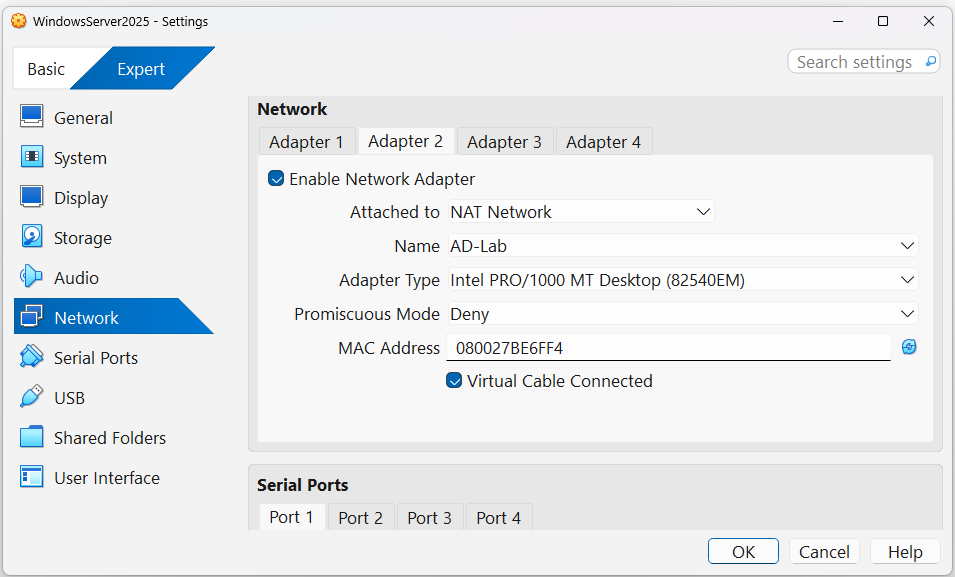
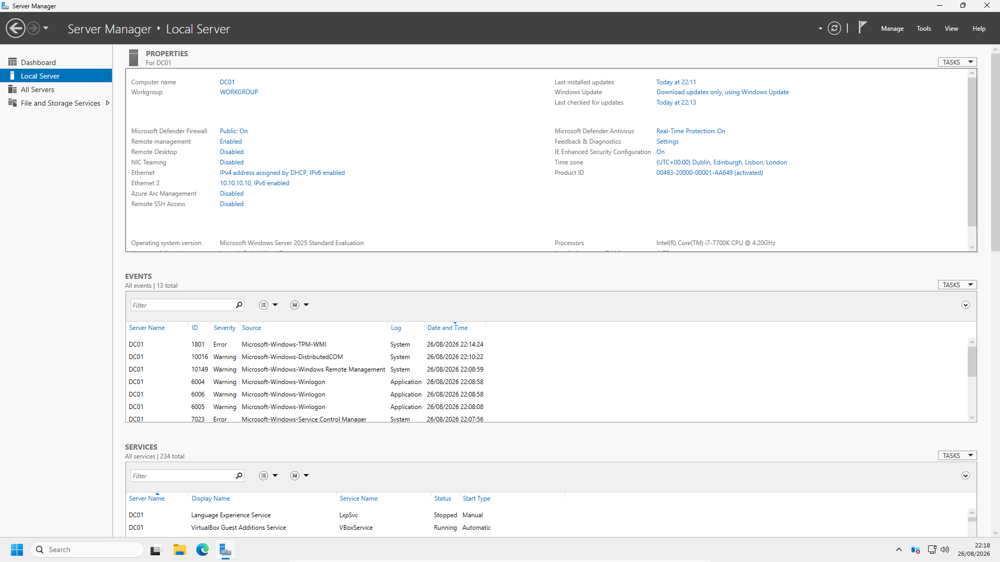
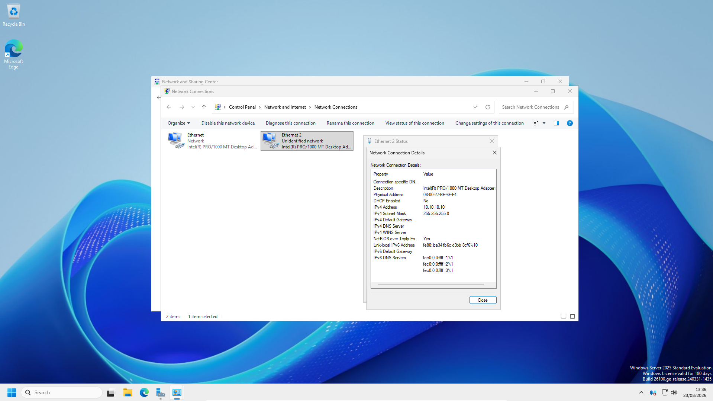
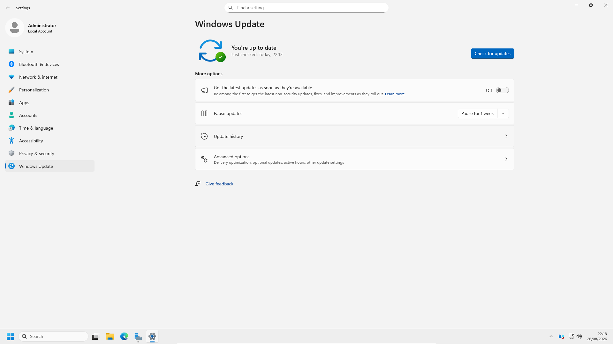

# Preparing Windows Server 2025

## Introduction

After installing Windows Server 2025, I prepared the server for its future role as the Domain Controller for the TechLab365 Active Directory laboratory.

This stage is important because Active Directory should not be installed on an unprepared server. I first established the server identity, designed the virtual network, configured the network interfaces, verified Internet connectivity and DNS resolution, corrected the server time zone and confirmed that Windows Server was fully updated.

The server is still a standalone computer at the end of this chapter. It remains a member of the local **WORKGROUP** until Active Directory Domain Services is installed and the server is promoted to a Domain Controller in a later chapter.

---

# Objectives

In this chapter, I prepared Windows Server 2025 for the Active Directory deployment by:

- Renaming the server to `DC01`.
- Creating the dedicated `AD-Lab` virtual network.
- Configuring two network adapters for DC01.
- Providing Internet connectivity through VirtualBox NAT.
- Creating a separate network for Active Directory traffic.
- Assigning a static IP address to the AD-Lab interface.
- Verifying the network configuration.
- Testing connectivity to the VirtualBox NAT gateway.
- Testing Internet connectivity.
- Testing DNS resolution.
- Configuring the correct UK time zone.
- Checking and installing Windows Updates.
- Performing a final server configuration verification.

---

# Lab Network Design

Before configuring the Windows network interfaces, I designed the virtual network that will be used by the laboratory.

I decided to use two network adapters on DC01:

```text
DC01
│
├── Adapter 1 → VirtualBox NAT
│                Internet connectivity
│
└── Adapter 2 → AD-Lab
                 Active Directory network
```

This separation allows DC01 to access the Internet through VirtualBox NAT while maintaining a dedicated network for communication between the Domain Controller and the Windows 11 domain client.

In a typical production environment, Internet access would normally be provided by dedicated network infrastructure such as a router or firewall rather than by the Domain Controller itself. The same principle is being reproduced in this laboratory: **DC01 is being prepared for directory and network services, not as the Internet gateway.**

---

# Creating the AD-Lab Network

I created a VirtualBox NAT Network named:

`AD-Lab`

The network was configured with:

```text
IPv4 Network: 10.10.10.0/24
DHCP: Disabled
```



### Why I used a separate network

The Active Directory laboratory requires a network on which the server and Windows 11 client can communicate directly.

I used the private IPv4 range `10.10.10.0/24`. The `/24` prefix means that the first 24 bits identify the network and the remaining 8 bits are available for host addresses.

The subnet mask is therefore:

```text
255.255.255.0
```

The network address is:

```text
10.10.10.0
```

and the usable host range is:

```text
10.10.10.1 – 10.10.10.254
```

The broadcast address is:

```text
10.10.10.255
```

I disabled the VirtualBox DHCP service because DHCP will be configured later as part of the Windows Server laboratory. This allows me to practise installing and administering the DHCP Server role rather than relying on VirtualBox to provide addresses for the AD-Lab network.

---

# Configuring the DC01 Network Adapters

I configured two network adapters for the Windows Server virtual machine.

## Adapter 1 — NAT

The first adapter is connected to the standard VirtualBox **NAT** network.



This adapter provides DC01 with Internet connectivity through the host computer.

The address assigned by VirtualBox was:

```text
IPv4 address: 10.0.2.15
Subnet mask: 255.255.255.0
Default gateway: 10.0.2.2
```

The address was obtained through DHCP provided by VirtualBox NAT.

### Why I used NAT

VirtualBox NAT provides a simple way for the virtual machine to reach external networks through the host's network connection.

Conceptually:

```text
DC01
10.0.2.15
     │
     ▼
VirtualBox NAT
     │
     ▼
Host network
     │
     ▼
Internet
```

NAT translates the private address used by the virtual machine so that its traffic can use the host's network connection.

This is similar to the NAT function performed by many real-world routers and firewalls, although VirtualBox NAT is not a replacement for an enterprise firewall or router.

---

## Adapter 2 — AD-Lab

The second adapter is connected to the dedicated `AD-Lab` NAT Network.



This interface is used for the internal laboratory network.

I deliberately kept this network separate from the NAT interface. The two interfaces therefore serve different purposes:

| Interface | Network | Purpose |
|---|---|---|
| Ethernet | VirtualBox NAT | Internet connectivity |
| Ethernet 2 | AD-Lab | Active Directory laboratory network |

Keeping the networks separate also avoids placing both interfaces in the same IP subnet, which could create routing and communication problems on a multi-homed server.

---

# Renaming the Server

The Windows Server installation initially assigned an automatically generated computer name.

I changed the computer name to:

```text
DC01
```



I selected `DC01` because it follows a common enterprise naming convention in which `DC` identifies a Domain Controller and `01` identifies the first server of that type.

At this stage, the server remained a member of:

```text
WORKGROUP
```

This is expected.

The server cannot become a member of an Active Directory domain until Active Directory Domain Services has been installed and the server has been promoted to a Domain Controller.

The naming and domain-promotion process therefore occurs in two separate stages:

```text
Standalone Server
      │
      │ Chapter 3
      ▼
DC01 / WORKGROUP
      │
      │ Install AD DS
      ▼
Domain Controller
      │
      ▼
Active Directory Domain
```

---

# Configuring the Static IP Address

After confirming the two network adapters, I configured the AD-Lab interface with a static IPv4 address.

The address assigned to DC01 on the AD-Lab network is:

```text
IP address:       10.10.10.10
Subnet mask:      255.255.255.0
Default gateway:  blank
DNS server:       blank
```



### Why DC01 needs a static IP

A Domain Controller needs a predictable network address.

Other systems will rely on DC01 for important services such as Active Directory and DNS. If the address of the server changed unexpectedly, clients could lose the ability to locate or communicate with those services.

For this reason, I assigned DC01 a fixed address on the AD-Lab network.

### Why there is no gateway on the AD-Lab interface

The AD-Lab network is not being used as the Internet connection.

Internet traffic uses the first adapter:

```text
Ethernet → NAT → Internet
```

The second adapter:

```text
Ethernet 2 → AD-Lab
```

is dedicated to the internal laboratory network.

Therefore, I did not configure a default gateway on the AD-Lab interface.

Having two default gateways on a multi-homed Windows Server could also introduce routing ambiguity. The Internet-facing NAT interface already provides the required default gateway.

---

# Understanding the /24 Subnet

The AD-Lab network uses:

```text
10.10.10.0/24
```

The `/24` means that 24 bits are used for the network portion of the address and 8 bits remain for host addresses.

In binary, the subnet mask is:

```text
11111111.11111111.11111111.00000000
```

which corresponds to:

```text
255.255.255.0
```

This gives the laboratory:

- Network address: `10.10.10.0`
- Usable host addresses: `10.10.10.1 – 10.10.10.254`
- Broadcast address: `10.10.10.255`

The address `10.10.10.10` assigned to DC01 is therefore a host address within the `10.10.10.0/24` subnet.

The `10.10.10.0/24` subnet is part of the private IPv4 `10.0.0.0/8` address space.

The three private IPv4 ranges I reviewed during this configuration are:

```text
10.x.x.x
172.16.x.x – 172.31.x.x
192.168.x.x
```

These addresses are intended for private networks and are not directly routable across the public Internet.

---

# Verifying the Network Configuration

After configuring the static IP, I used Command Prompt and `ipconfig` to verify the configuration.

The important results were:

```text
Ethernet
IPv4 Address:    10.0.2.15
Subnet Mask:     255.255.255.0
Default Gateway: 10.0.2.2
```

and:

```text
Ethernet 2
IPv4 Address:    10.10.10.10
Subnet Mask:     255.255.255.0
Default Gateway: blank
```

The configuration confirmed that the two network interfaces were operating on separate subnets.

---

# Testing Connectivity

I tested the VirtualBox NAT gateway using:

```cmd
ping 10.0.2.2
```

The successful response confirmed connectivity between DC01 and the VirtualBox NAT gateway.

I then tested external IP connectivity using:

```cmd
ping 1.1.1.1
```

The successful response confirmed that DC01 could reach the Internet using an IP address.

I also reviewed the distinction between testing IP connectivity and testing DNS.

A successful ping to a public IP address proves network connectivity, but it does not prove that DNS resolution is working.

For comparison, `8.8.8.8` could also be used as a public IP connectivity test. It is Google's public DNS service, while `1.1.1.1` is operated by Cloudflare.

---

# Verifying DNS Resolution

To test DNS separately from basic IP connectivity, I used:

```cmd
nslookup www.microsoft.com
```

The result showed:

```text
Server:  one.one.one.one
Address: 1.1.1.1
```

and successfully returned addresses for `www.microsoft.com`.

This confirmed that DNS resolution was working through the current Internet-facing configuration.

### Important distinction

The tests demonstrate two different things:

```text
ping 1.1.1.1
        ↓
IP connectivity

nslookup www.microsoft.com
        ↓
DNS resolution
```

This distinction is useful when troubleshooting. A computer may be able to reach an IP address while still having a DNS problem.

---

# DNS and Active Directory

At this stage, I deliberately did not configure the AD-Lab interface to use `1.1.1.1` as its permanent DNS server.

Once Active Directory Domain Services is installed, DC01 will provide the DNS service required by the Active Directory domain.

Active Directory depends heavily on DNS for locating domain services and Domain Controllers.

Therefore, the DNS configuration will be revisited as part of the Active Directory deployment rather than being treated as a final configuration during this preparation stage.

---

# Configuring the Time Zone

The server initially displayed the wrong time zone.

I changed the Windows time zone to:

```text
(UTC+00:00) Dublin, Edinburgh, Lisbon, London
```

Windows identifies this time zone as:

```text
GMT Standard Time
```

I verified that the displayed time was then correct for the UK.

### Why accurate time matters

Accurate time is particularly important in Active Directory environments because authentication mechanisms such as Kerberos rely on time synchronisation.

A significant time difference between a client and a Domain Controller can cause authentication failures.

Correcting the time zone and verifying the server clock before deploying Active Directory therefore removes a potential source of problems later.

---

# Windows Update

Before continuing with the Active Directory deployment, I checked Windows Update.

Windows reported:

**You're up to date**



Keeping the operating system updated reduces the risk of starting the Active Directory deployment with known outstanding Windows updates.

---

# Final Configuration Verification

The final Server Manager → Local Server view was used to verify the main preparation settings.


The final configuration confirmed:

| Configuration | Result |
|---|---|
| Computer name | `DC01` |
| Current membership | `WORKGROUP` |
| NAT interface | DHCP / `10.0.2.15` |
| AD-Lab interface | Static / `10.10.10.10` |
| AD-Lab subnet | `10.10.10.0/24` |
| AD-Lab gateway | None |
| Time zone | London |
| Windows Update | Up to date |

The server is now prepared for the next stage of the laboratory.

---

# Troubleshooting Knowledge

Several useful troubleshooting concepts were reinforced during this chapter.

### Different subnets on a multi-homed server

The NAT interface and AD-Lab interface must use different subnets.

The final design is:

```text
Ethernet
10.0.2.15/24
      │
      └── VirtualBox NAT → Internet

Ethernet 2
10.10.10.10/24
      │
      └── AD-Lab → Active Directory network
```

Using the same subnet on both interfaces could create routing and communication problems.

### APIPA address

Before the static address was configured, the AD-Lab interface received an address in the:

```text
169.254.x.x
```

range.

This is an **APIPA** address. It appeared because DHCP was disabled on the AD-Lab network and no static address had yet been configured.

This provided a useful practical example of how Windows behaves when a network interface cannot obtain an address from DHCP.

### IP connectivity versus DNS

The tests also reinforced that:

```text
ping 1.1.1.1
```

tests IP connectivity, whereas:

```text
nslookup www.microsoft.com
```

tests DNS resolution.

This distinction is important when troubleshooting network problems because successful Internet connectivity does not automatically mean that DNS is functioning correctly.

---

# Key Learnings

During this chapter, I learned and reinforced the following concepts:

- A Domain Controller should have a predictable IP address.
- A multi-homed server should use separate subnets for different network functions.
- VirtualBox NAT can provide Internet connectivity without making the Domain Controller the Internet gateway.
- The AD-Lab network can remain isolated from the Internet-facing network.
- A `/24` subnet uses 24 network bits and 8 host bits.
- `10.10.10.0/24` provides 254 usable host addresses.
- Private IPv4 addresses are appropriate for internal laboratory networks.
- DHCP and static addressing serve different purposes.
- APIPA addresses can indicate that a device failed to obtain a DHCP address.
- IP connectivity and DNS resolution are separate troubleshooting tests.
- Correct time configuration is important before deploying Active Directory.
- Active Directory relies heavily on DNS.
- A server can remain in `WORKGROUP` until it is promoted to a Domain Controller.

---

# Skills Demonstrated

During this chapter, I demonstrated practical experience with:

- Windows Server network configuration.
- VirtualBox NAT networking.
- NAT Network configuration.
- Static IPv4 configuration.
- Subnetting and subnet masks.
- Multi-homed Windows Server configuration.
- Network connectivity testing.
- DNS troubleshooting and verification.
- Windows Server time-zone configuration.
- Windows Update.
- Server Manager.
- Command Prompt networking tools.
- Technical troubleshooting.
- Technical documentation.

---

# Interview Tip

A useful interview question could be:

**“Why did you give the Domain Controller a static IP address?”**

My answer would be:

> “I gave DC01 a static IP on the Active Directory network because the Domain Controller needs a predictable address. Clients will rely on it for Active Directory and DNS services, so its address should not change unexpectedly.”

Another possible question is:

**“Why does DC01 have two network adapters?”**

My answer would be:

> “I separated the Internet-facing connection from the internal Active Directory network. The first adapter uses VirtualBox NAT for Internet connectivity, while the second adapter uses the dedicated AD-Lab network for communication with the domain client. This also avoids using the Domain Controller as the Internet gateway.”

---

# Chapter Summary

In this chapter, I prepared the Windows Server 2025 installation for its future role as the TechLab365 Active Directory Domain Controller.

I renamed the server to **DC01**, created the dedicated **AD-Lab** network using `10.10.10.0/24`, configured two network adapters and assigned the AD-Lab interface the static address `10.10.10.10`.

I verified connectivity to the VirtualBox NAT gateway and the Internet, then separately verified DNS resolution using `nslookup`.

I also corrected the server time zone to London, confirmed that Windows Update reported the server as up to date and performed a final configuration check.

The server remains in **WORKGROUP** at the end of this chapter. It is now prepared for the installation of **Active Directory Domain Services**, which will be covered in the next stage of the laboratory.

---

# Next Chapter

Continue directly to:

**[Chapter 4 – Installing Windows 11](../04-Installing-Windows-11/Installing-Windows-11.md)**
