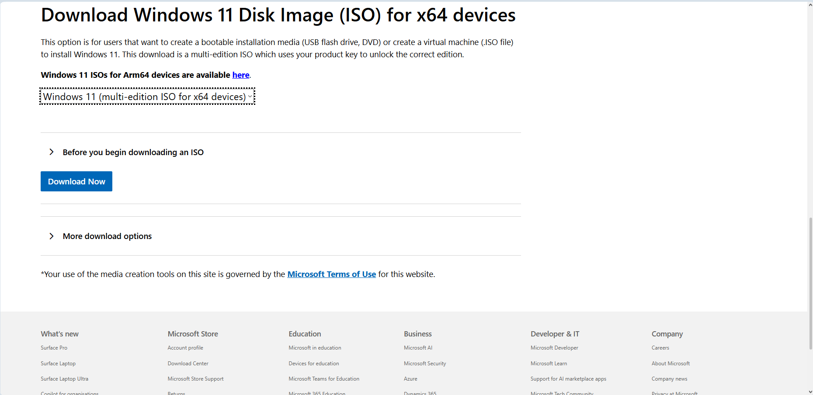
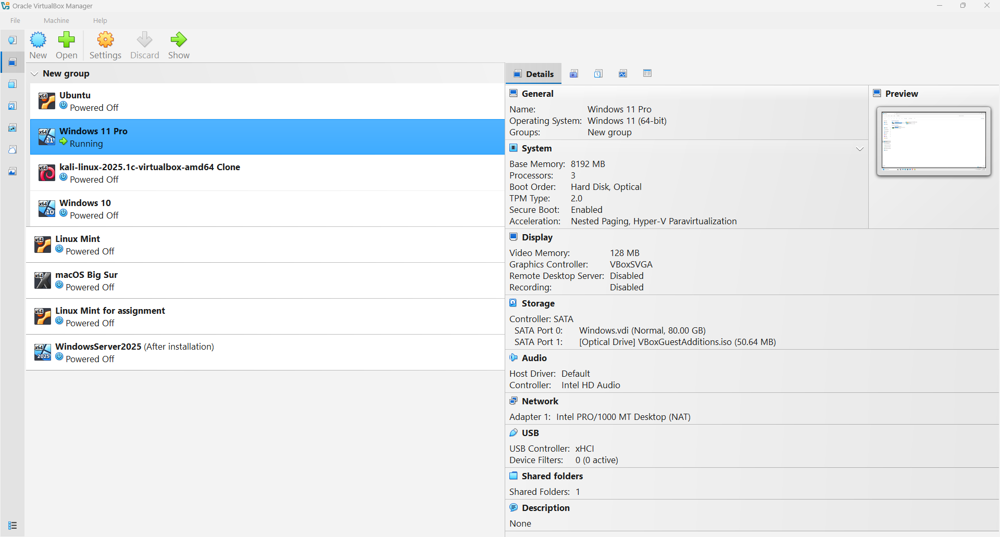
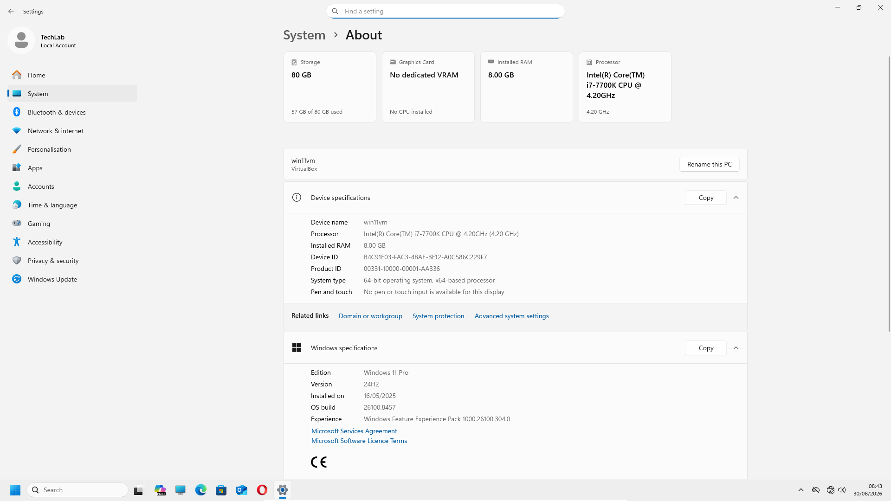

# Installing Windows 11

## Introduction

Windows 11 Pro is the client operating system used as the workstation component of the TechLab365 Windows Server and Active Directory laboratory.

The operating system was installed as a virtual machine using Oracle VirtualBox. The objective of this chapter is not simply to install Windows 11, but to document the complete process used to create a repeatable client environment that can later be configured and joined to the Active Directory domain.

For this laboratory, **Windows 11 Pro** was selected because the virtual machine will later be used as a domain client within the Active Directory environment.

The installation was performed manually rather than using VirtualBox unattended installation. This is important because the laboratory is intended to reproduce the type of operating system deployment and administration tasks that an IT professional would normally perform when preparing a Windows client.

---

# Objectives

After completing this chapter, I will be able to:

- Download the official Windows 11 ISO.
- Create a Windows 11 virtual machine in Oracle VirtualBox.
- Configure the virtual hardware required by the laboratory.
- Perform a manual Windows 11 installation.
- Select the appropriate Windows edition.
- Complete the initial Windows setup.
- Install Oracle VirtualBox Guest Additions.
- Configure the virtual machine for a practical administration environment.
- Verify that Windows 11 is installed and operational.

---

# Prerequisites

Before starting this chapter, ensure you have:

- Oracle VirtualBox installed on the Windows host.
- Administrator permissions on the Windows host.
- A Windows 11 ISO obtained from the official Microsoft download page.
- Sufficient host storage for the virtual machine.
- Sufficient system memory to run the Windows 11 virtual machine.

The VirtualBox installation is documented in **Chapter 1 – Installing Oracle VirtualBox**.

---

# Lab Configuration

The Windows 11 virtual machine was created with the following configuration:

| Component | Configuration |
|---|---|
| Hypervisor | Oracle VirtualBox |
| VM Name | `Windows 11 Pro` |
| Operating System | Windows 11 Pro (64-bit) |
| Memory | 8192 MB |
| Processors | 3 |
| TPM | Version 2.0 |
| Secure Boot | Enabled |
| Video Memory | 128 MB |
| Graphics Controller | VBoxSVGA |
| Virtual Disk | 80 GB |
| Installation Method | Manual |
| Network | NAT |

The virtual machine was initially created using the name **Windows 11 Pro** to clearly identify the operating system installed inside VirtualBox.

The Windows computer hostname is configured separately during the preparation stage of the laboratory and is therefore intentionally not covered in this chapter.

---

# Downloading the Windows 11 ISO

The Windows 11 installation media was obtained from the official Microsoft download page.



The **Windows 11 multi-edition ISO for x64 devices** was selected as the installation media for the virtual machine.

Using an official Microsoft source ensures that the installation media used in the laboratory is obtained directly from the operating system vendor.

---

# Creating the Windows 11 Virtual Machine

The Windows 11 virtual machine was created from Oracle VirtualBox Manager.

The virtual machine was configured for a 64-bit Windows 11 operating system and assigned 8 GB of memory and three virtual processors. An 80 GB virtual hard disk was created for the operating system.

Windows 11 has additional hardware requirements compared with previous Windows versions. For this reason, TPM 2.0 and Secure Boot were enabled in the virtual machine configuration.



The virtual machine was configured to use the downloaded Windows 11 ISO as its optical installation media.

## Manual Installation

Oracle VirtualBox provides an option to configure an unattended guest operating-system installation. This option was **not used** for this laboratory.

The installation was performed manually so that Windows Setup could run normally and the important installation decisions could be made directly.

This approach also makes the procedure easier to reproduce if the virtual machine needs to be rebuilt in the future.

---

# Starting Windows 11 Setup

After the virtual machine was created, it was started with the Windows 11 ISO attached.

Windows Setup started from the installation media and displayed the standard Windows installation process.

The installation was completed manually, allowing the required options to be selected directly during the setup process.

---

# Selecting the Windows Edition

Windows 11 installation media can contain multiple editions.

For this laboratory, the following edition was selected:

**Windows 11 Pro**

The Professional edition was deliberately selected because this virtual machine will later be used as a client computer in the Active Directory laboratory.

The client will subsequently be configured and joined to the domain created in later chapters.

---

# Completing Windows 11 Setup

After selecting the required edition, Windows Setup was continued using the standard installation process.

The Microsoft licence terms were accepted and the virtual disk was selected as the installation destination.

The 80 GB virtual disk created earlier was available to Windows Setup. Windows created the system partitions required for the operating system and continued with the installation.

Windows then copied the installation files and restarted the virtual machine as required.

Once the operating system installation completed, the Windows out-of-box experience was completed and the local user environment was created.

At this point, Windows 11 was successfully installed, but the client had not yet been prepared for the Active Directory laboratory.

Network configuration, computer naming and domain preparation are deliberately left for the following chapter.

---

# Installing Oracle VirtualBox Guest Additions

After the first successful Windows 11 sign-in, Oracle VirtualBox Guest Additions were installed.

Guest Additions are useful in this laboratory because they improve the integration between the Windows guest and the Windows host. In particular, they provide improved display handling and allow the virtual machine display to work more effectively when changing the VirtualBox window size or using full-screen mode.

The installation was started from the VirtualBox menu:

**Devices → Insert Guest Additions CD Image…**

The Guest Additions ISO was then mounted inside Windows as a virtual CD.

Inside the mounted CD, the installer was started by running:

```text
VBoxWindowsAdditions.exe
```

The installation was completed using the standard options.

The virtual machine was subsequently restarted if required so that the Guest Additions installation could be completed.

---

# Configuring the Virtual Machine Display

After installing Guest Additions, the Windows 11 display could be resized and used more effectively inside VirtualBox.

VirtualBox can then be used in a larger window or in full-screen mode, providing a more practical working environment for the administration tasks performed later in the laboratory.

The display configuration is not an Active Directory requirement; it is a usability configuration that makes the virtual client easier to work with during the remaining chapters.

---

# Verifying the Windows 11 Installation

After installation, Windows 11 was verified from:

**Settings → System → About**



The verification confirmed that Windows 11 Pro was installed successfully and that the virtual machine was operational.

The system information also confirmed the installed memory and processor configuration.

At this stage, the computer remains a standalone Windows 11 installation. It has not yet been configured for the Active Directory environment and has not joined a domain.

---

# Verification

The installation was considered successful after verifying that:

- Windows 11 starts correctly.
- Windows 11 Pro is installed.
- The local user environment can sign in successfully.
- The virtual machine has the intended 8 GB memory allocation.
- The virtual machine has three processors.
- TPM 2.0 is enabled.
- Secure Boot is enabled.
- The virtual hard disk is 80 GB.
- Oracle VirtualBox Guest Additions are installed.
- The Windows 11 display can be used effectively inside VirtualBox.

---

# Key Learnings

During this chapter, I learned that:

- A Windows 11 client environment can be built safely inside a virtual machine without affecting the host operating system.
- Virtual machine hardware must be planned before installing the operating system.
- Windows 11 has specific virtual hardware requirements, including TPM 2.0 and Secure Boot.
- The correct Windows edition must be selected according to the intended use of the client.
- A manual installation provides greater control over the initial operating system setup than an unattended installation.
- VirtualBox Guest Additions improve the usability and integration of the guest operating system.
- A Windows client should be verified before proceeding with further network and domain configuration.

---

# Skills Demonstrated

During this chapter, I demonstrated practical experience in:

- Downloading official Windows installation media.
- Creating a Windows 11 virtual machine.
- Configuring virtual hardware.
- Configuring TPM 2.0 and Secure Boot in a virtual machine.
- Installing Windows 11 Pro.
- Performing a manual Windows installation.
- Completing the Windows initial setup process.
- Installing Oracle VirtualBox Guest Additions.
- Verifying a Windows 11 installation.
- Preparing a client environment for future Active Directory integration.
- Producing technical documentation using GitHub and Markdown.

---

# Interview Tip

For a First Line or IT Support role, practical experience installing and preparing Windows client operating systems is valuable because many support environments involve deploying, configuring and troubleshooting Windows endpoints.

A useful way to describe this laboratory experience in an interview is:

> “I built a Windows 11 Pro client virtual machine from scratch using Oracle VirtualBox. I configured the virtual hardware, including TPM 2.0 and Secure Boot, performed a manual installation, installed Guest Additions and verified the operating system before preparing the client for an Active Directory environment.”

This demonstrates that the experience is based on a **hands-on laboratory rather than only theoretical study**.

---

# Chapter Summary

In this chapter, I created and installed a Windows 11 Pro virtual machine using Oracle VirtualBox.

The virtual machine was configured with 8 GB of memory, three processors, TPM 2.0, Secure Boot and an 80 GB virtual disk. Windows 11 Pro was installed manually, allowing the installation decisions and initial setup process to be performed directly.

Following the installation, Oracle VirtualBox Guest Additions were installed and the virtual machine was configured for practical use. The Windows 11 installation was then verified through the system information page.

The Windows 11 client is now installed and ready for the next stage of the laboratory: preparing the client for communication with the Active Directory environment.

---

# Next Chapter

Continue directly to:

**[Chapter 5 – Preparing Windows 11](../05-Preparing-Windows-11/Preparing-Windows-11.md)**
