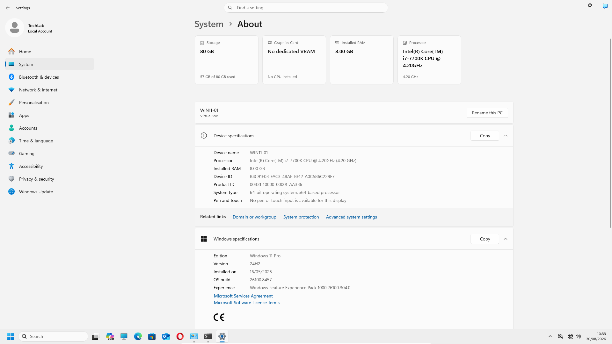
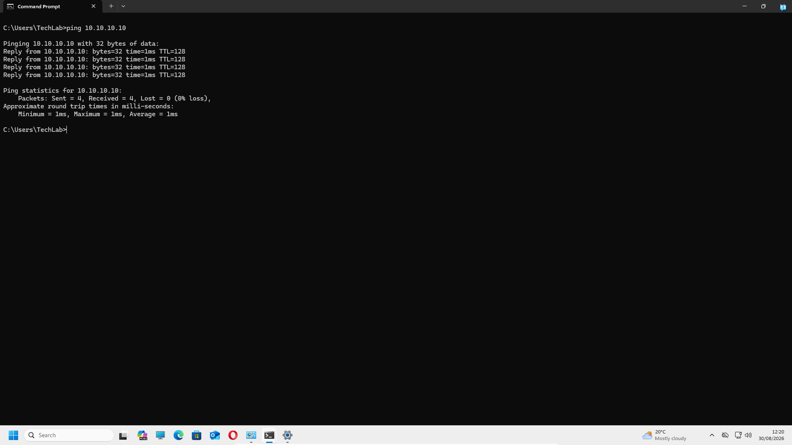

# Preparing Windows 11

## Introduction

With Windows 11 successfully installed in the previous chapter, the next stage of the laboratory was to prepare the client operating system for its future role as an Active Directory domain workstation.

The purpose of this chapter is not simply to configure a Windows 11 virtual machine. The workstation must be prepared using a network configuration that supports both internet access and communication with the internal Active Directory infrastructure.

For this laboratory, `WIN11-01` was configured with two network adapters. The first adapter provides internet connectivity, while the second connects the workstation to the dedicated `AD-Lab` internal network shared with the Windows Server.

During the configuration process, an internal connectivity issue was encountered when testing communication with the Windows Server. Rather than changing multiple settings without understanding the cause, the issue was investigated step by step. The final solution demonstrated how Windows Firewall configuration can affect network troubleshooting results even when IP addressing and network connectivity are otherwise correct.

By the end of this chapter, the Windows 11 client is configured, tested and ready to support the next stages of the Active Directory laboratory.

---

# Objectives

After completing this chapter, I will be able to:

- Rename a Windows 11 workstation using a clear and scalable naming convention.
- Review the Windows 11 client configuration.
- Configure a dual-network virtual machine environment.
- Configure an internal network adapter with a static IPv4 address.
- Understand why the internal adapter does not require a default gateway.
- Verify internet connectivity independently from internal lab connectivity.
- Test DNS resolution using Windows command-line tools.
- Test communication between the Windows 11 client and Windows Server.
- Investigate a failed connectivity test systematically.
- Use PowerShell to inspect Windows network and firewall configuration.
- Enable a specific Windows Firewall rule to resolve an ICMP connectivity issue.
- Verify that the Windows 11 client is ready for Active Directory integration.

---

# Prerequisites

Before starting this chapter, ensure that:

- Oracle VirtualBox is installed on the host computer.
- The Windows 11 virtual machine has been successfully installed.
- The Windows Server virtual machine has been created.
- The `AD-Lab` internal network has been configured in VirtualBox.
- The Windows Server internal network adapter is configured with the address `10.10.10.10`.
- Both virtual machines are connected to the same `AD-Lab` internal network.

The installation of Windows 11 is documented in **Chapter 4 – Installing Windows 11**.

The Windows Server network configuration was completed as part of the server preparation stage before configuring the Windows 11 client.

---

# Lab Configuration

The Windows 11 client was prepared using the following configuration:

| Component | Configuration |
|---|---|
| Computer Name | `WIN11-01` |
| Operating System | Windows 11 Pro |
| Internet Network | NAT |
| Internal Network | `AD-Lab` |
| Internal Client IP | `10.10.10.20` |
| Internal Subnet Mask | `255.255.255.0` |
| Domain Controller Name | `DC01` |
| Domain Controller IP | `10.10.10.10` |
| Internal Network | `10.10.10.0/24` |

The workstation uses two network adapters with separate responsibilities:

```text
                    Internet
                       │
                       │
                    NAT
                       │
                 ┌─────┴─────┐
                 │ WIN11-01  │
                 │           │
                 └─────┬─────┘
                       │
                    AD-Lab
                       │
                 ┌─────┴─────┐
                 │   DC01    │
                 └───────────┘
```

The NAT adapter provides external connectivity, while the `AD-Lab` adapter provides isolated communication with the Windows Server infrastructure.

This design was deliberately selected to simulate a more realistic environment where internal infrastructure communication is separated from the external network.

---

# Renaming the Windows 11 Workstation

After installation, the Windows 11 computer was renamed:

```text
WIN11-01
```

A generic name such as `WIN11` would not be suitable for an environment containing multiple Windows workstations. A naming convention such as `WIN11-01` provides a more scalable approach and makes individual devices easier to identify.

The naming convention used throughout the laboratory is:

```text
DC01      → Windows Server / Domain Controller
WIN11-01  → Windows 11 client workstation
```

The computer was restarted after the name change so that the new hostname was applied correctly.

This naming structure will remain consistent throughout the rest of the laboratory and will make the client easier to identify when it is later joined to Active Directory.



---

# Reviewing the Network Architecture

The Windows 11 virtual machine requires two network adapters because the laboratory has two different connectivity requirements.

## Internet Adapter

The first adapter provides access to the internet.

This connection is required for activities such as:

- Accessing external websites.
- Downloading updates.
- Testing DNS resolution.
- General external connectivity.

The adapter is connected through the VirtualBox NAT configuration.

## AD-Lab Adapter

The second adapter connects the Windows 11 client to the dedicated internal laboratory network:

```text
AD-Lab
```

This adapter is used for communication with the Windows Server and, later, the Active Directory Domain Controller.

The two adapters are intentionally separated because they serve different purposes.

| Adapter | Purpose |
|---|---|
| Internet | External connectivity through NAT |
| AD-Lab | Private communication with the Windows Server |

This configuration allows the Windows 11 client to maintain internet access while also communicating directly with the internal infrastructure.

---

# Configuring the Network Adapters

The Windows 11 client was configured with two network interfaces.

The adapters were renamed to clearly identify their purpose:

```text
Internet
AD-Lab
```

Using meaningful adapter names makes troubleshooting easier because the function of each interface is immediately visible.

The network adapters were verified using PowerShell:

```powershell
Get-NetAdapter
```

The final configuration confirmed two active interfaces:

```text
Internet
AD-Lab
```

---

# Configuring the AD-Lab Network Adapter

The internal `AD-Lab` adapter was configured manually with a static IPv4 address.

The configuration used was:

```text
IP Address:      10.10.10.20
Subnet Mask:     255.255.255.0
Default Gateway: Not configured
```

The Windows Server uses the internal address:

```text
10.10.10.10
```

The Windows 11 client therefore uses:

```text
10.10.10.20
```

Both systems are located on the same internal subnet:

```text
10.10.10.0/24
```

No default gateway was configured on the `AD-Lab` adapter.

This is intentional because the adapter is only responsible for communication with devices on the internal laboratory network. Internet traffic is handled by the separate NAT adapter.

Keeping the default gateway on the internet-facing adapter avoids creating unnecessary or conflicting routes for external traffic.

---

# Verifying the Windows 11 Network Configuration

After configuring the adapters, the final network configuration was reviewed using:

```cmd
ipconfig /all
```

The output confirmed that the Windows 11 client had two separate network interfaces.

## Internet Adapter

The internet adapter was configured with:

- An IPv4 address provided by the NAT network.
- A default gateway.
- DNS servers.
- Internet connectivity.

## AD-Lab Adapter

The internal adapter was configured with:

```text
IPv4 Address: 10.10.10.20
Subnet Mask:  255.255.255.0
Default Gateway:
```

The absence of a default gateway on the internal adapter is part of the intended design.


This verification confirmed that Windows 11 had the required configuration before connectivity testing began.

---

# Verifying Internet Connectivity

Before investigating communication with the internal network, internet connectivity was tested independently.

The first test used a public IP address:

```cmd
ping 8.8.8.8
```

The command returned successful replies, confirming that the Windows 11 client could communicate with an external IP address.

DNS resolution was then tested using:

```cmd
nslookup google.com
```

The hostname was resolved successfully.

Finally, connectivity using a hostname was tested:

```cmd
ping google.com
```

This test confirmed that:

- Internet connectivity was working.
- The default route was functioning correctly.
- DNS resolution was working.

Testing these components separately was important because it confirmed that the NAT adapter was operating correctly before the internal network was investigated.

---

# Testing Internal Lab Connectivity

The next step was to test communication between the Windows 11 client and the Windows Server.

The Windows 11 client was configured with:

```text
WIN11-01
10.10.10.20
```

The Windows Server was configured with:

```text
DC01
10.10.10.10
```

The connection was tested from Windows 11:

```cmd
ping 10.10.10.10
```

Initially, the test failed with:

```text
Request timed out.
```

This indicated that the Windows 11 client was not receiving ICMP replies from the Windows Server.

Rather than immediately changing IP addresses or modifying the VirtualBox configuration, the problem was investigated systematically.

---

# Investigating the Connectivity Issue

The first step was to verify that the Windows Server virtual machine was running.

The Windows Server network configuration was then checked using:

```cmd
ipconfig /all
```

The output confirmed that the internal adapter was configured correctly:

```text
IPv4 Address: 10.10.10.10
Subnet Mask:  255.255.255.0
```

The Windows Server was also able to ping the Windows 11 client:

```cmd
ping 10.10.10.20
```

The test was successful.

This was an important result because it confirmed that:

- Both virtual machines were connected to the internal network.
- Both machines had addresses on the same subnet.
- The server could communicate with the client.

The investigation could therefore move away from IP addressing and VirtualBox network configuration.

The next logical step was to investigate whether the Windows Server was blocking inbound ICMP requests.

---

# Checking the Windows Firewall Configuration

PowerShell was used on the Windows Server to review the network connection profiles:

```powershell
Get-NetConnectionProfile
```

The internal network was shown as an unidentified network with a Public network category.

The Windows Firewall rules relating to ICMP Echo Requests were then reviewed:

```powershell
Get-NetFirewallRule -DisplayName "*Echo Request*" | Select-Object DisplayName, Enabled
```

The relevant inbound ICMPv4 Echo Request rule was disabled.

This identified the reason why the Windows 11 client could not successfully ping the Windows Server.

The failed ping was not caused by incorrect IP addressing or a VirtualBox networking problem. The Windows Firewall was preventing the server from responding to inbound ICMP Echo Requests.

---

# Resolving the Connectivity Issue

The required Windows Firewall rule was enabled using PowerShell:

```powershell
Enable-NetFirewallRule -DisplayName "Core Networking Diagnostics - ICMP Echo Request (ICMPv4-In)"
```

The configuration was then verified:

```powershell
Get-NetFirewallRule -DisplayName "Core Networking Diagnostics - ICMP Echo Request (ICMPv4-In)" | Select-Object DisplayName, Enabled
```

The output confirmed that the rule was enabled.

The connectivity test was then repeated from the Windows 11 client.

The Windows Server successfully responded to the ping requests.


This troubleshooting process demonstrates an important networking principle: a failed ping does not automatically mean that two devices are disconnected. A host firewall can prevent ICMP responses even when the underlying network connection is functioning correctly.

---

# Final Connectivity Verification

The final test was performed from `WIN11-01`:

```cmd
ping 10.10.10.10
```

The Windows Server responded successfully.

The result confirmed:

```text
Packets: Sent = 4, Received = 4, Lost = 0 (0% loss)
```

Communication between the two lab machines was now working correctly:

```text
WIN11-01
10.10.10.20
     │
     │
  AD-Lab
     │
     │
DC01
10.10.10.10
```



At this stage, both network paths had been independently tested:

- Internet connectivity through NAT.
- Internal connectivity through the `AD-Lab` network.

---

# Verification

The Windows 11 preparation was considered successful after confirming that:

- The Windows 11 workstation was renamed to `WIN11-01`.
- The two network adapters were correctly configured.
- The adapters were clearly named `Internet` and `AD-Lab`.
- The internet adapter provided external connectivity.
- The internal adapter was configured with the static address `10.10.10.20`.
- The internal adapter did not contain a default gateway.
- The Windows 11 client could reach an external IP address.
- DNS resolution was working correctly.
- The Windows 11 client could communicate with the Windows Server.
- The connectivity issue was identified and resolved.
- The final ping test to `10.10.10.10` completed successfully.

---

# Key Learnings

During this chapter, I learned that:

- A Windows workstation can use multiple network adapters for different purposes.
- Network adapter names should clearly identify the purpose of each connection.
- A static IP address is appropriate for predictable communication with internal infrastructure.
- An internal-only network adapter does not require a default gateway.
- Internet connectivity and internal network connectivity should be tested independently.
- `ping` can be used to test basic IP connectivity.
- `nslookup` can be used to test DNS name resolution.
- `ipconfig /all` provides detailed information about Windows network configuration.
- A failed ping does not automatically indicate an IP addressing or network configuration problem.
- Windows Firewall rules can prevent a host from responding to ICMP requests.
- PowerShell can be used to inspect and modify Windows Firewall configuration.
- Troubleshooting should be performed methodically rather than changing multiple settings without identifying the cause.

---

# Skills Demonstrated

During this chapter, I demonstrated practical experience in:

- Preparing a Windows 11 client workstation.
- Applying a scalable workstation naming convention.
- Configuring multiple network adapters.
- Working with VirtualBox NAT and internal networking.
- Configuring static IPv4 addressing.
- Understanding default gateway configuration.
- Testing internet connectivity.
- Testing DNS resolution.
- Troubleshooting client-to-server connectivity.
- Using `ipconfig`, `ping` and `nslookup`.
- Using PowerShell networking commands.
- Investigating Windows Firewall rules.
- Enabling a specific firewall rule to resolve a connectivity issue.
- Performing structured network troubleshooting.
- Documenting practical technical work using GitHub and Markdown.

---

# Interview Tip

For a First Line or IT Support role, network troubleshooting is an important practical skill because connectivity problems can be caused by several different components, including IP configuration, DNS, routing and host firewalls.

A useful way to describe this laboratory experience in an interview is:

> “While preparing my Windows 11 client for an Active Directory lab, I configured separate internet and internal network adapters and encountered a connectivity issue when testing communication with the Windows Server. I verified the addressing, tested connectivity from both directions and then used PowerShell to identify that the Windows Firewall was blocking inbound ICMP requests. After enabling the appropriate rule, I confirmed successful communication between the client and server.”

This demonstrates a structured troubleshooting approach based on identifying the root cause rather than changing configuration settings at random.

---

# Chapter Summary

In this chapter, the Windows 11 virtual machine was prepared to operate as the client workstation within the Active Directory laboratory.

The workstation was renamed to `WIN11-01` using a clear naming convention suitable for an environment containing multiple computers. Two network adapters were configured to provide separate internet and internal laboratory connectivity.

The `Internet` adapter provides external connectivity through VirtualBox NAT, while the `AD-Lab` adapter was configured with the static address `10.10.10.20` for communication with the Windows Server at `10.10.10.10`.

Internet connectivity and DNS resolution were successfully verified. During internal connectivity testing, the Windows 11 client was initially unable to ping the Windows Server. The issue was investigated by checking the server network configuration, testing communication in the opposite direction and reviewing the Windows Firewall rules.

The root cause was identified as a disabled inbound ICMPv4 Echo Request rule. After enabling the rule with PowerShell, successful communication between `WIN11-01` and `DC01` was confirmed.

The Windows 11 client is now configured and ready for the next stage of the Active Directory laboratory.

---

# Next Chapter

Continue directly to:

**[Chapter 6 – Installing Active Directory Domain Services](../06-Installing-Active-Directory-Domain-Services/Installing-Active-Directory-Domain-Services.md)**
