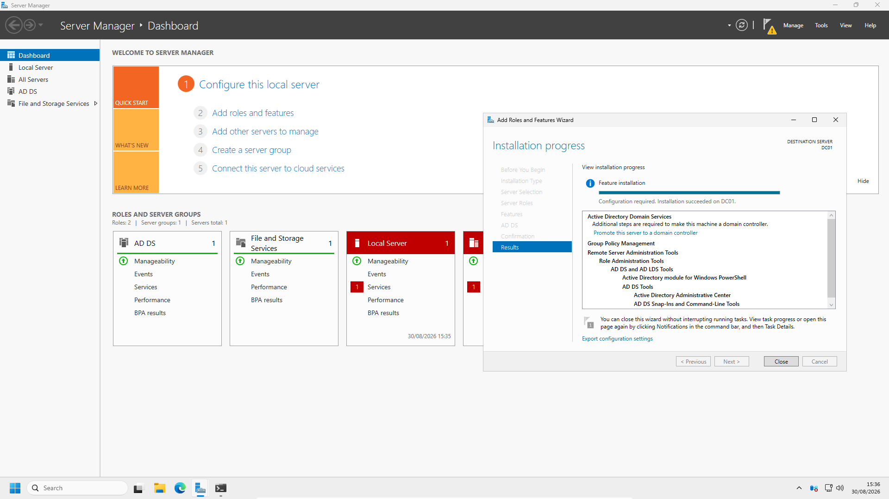
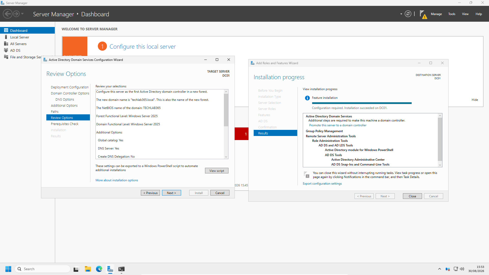
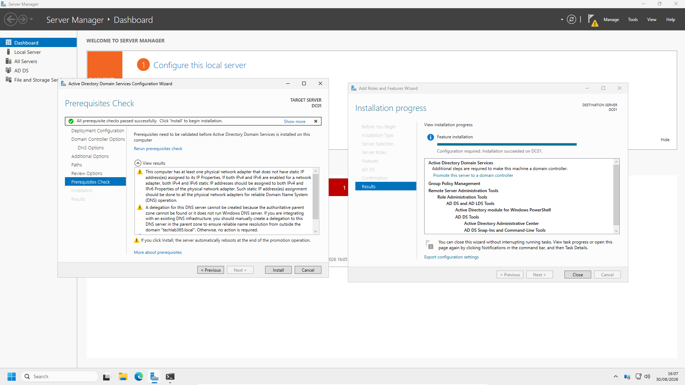
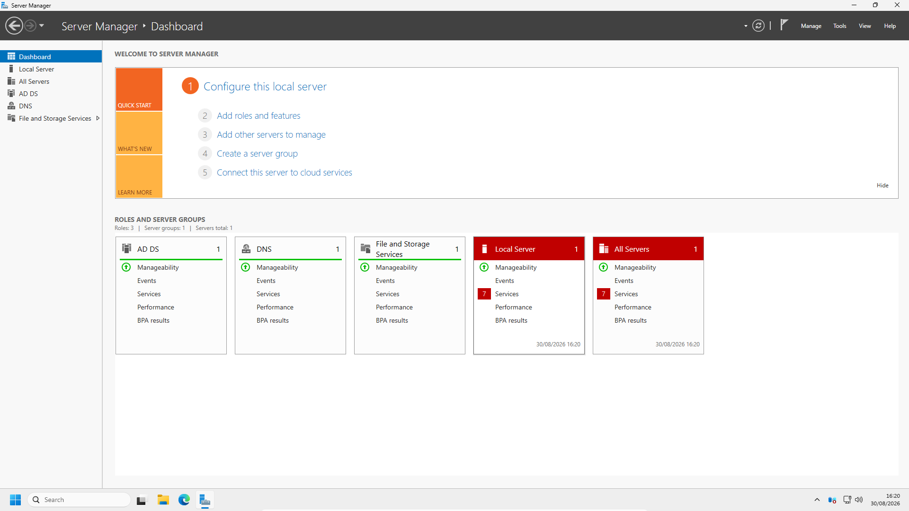
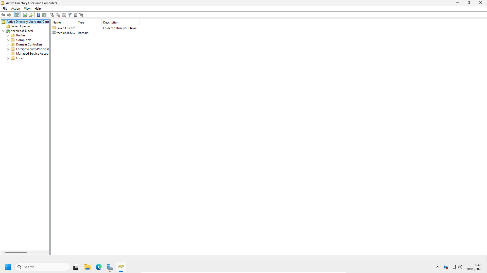
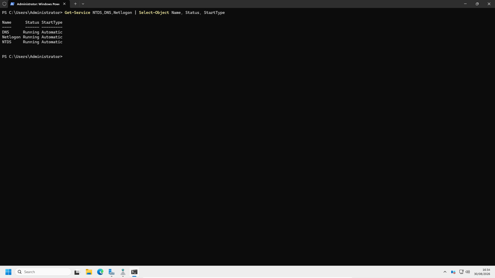
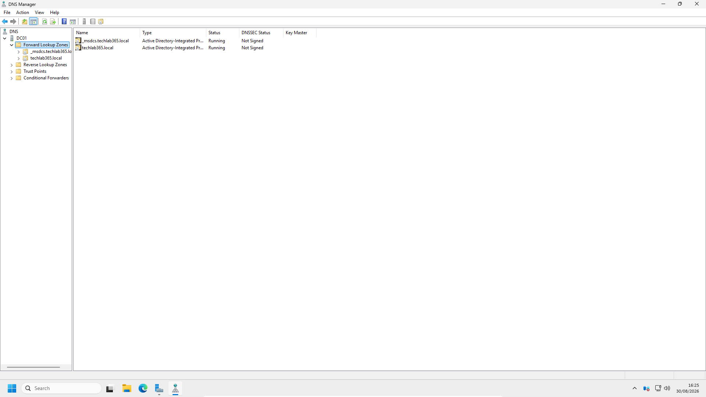
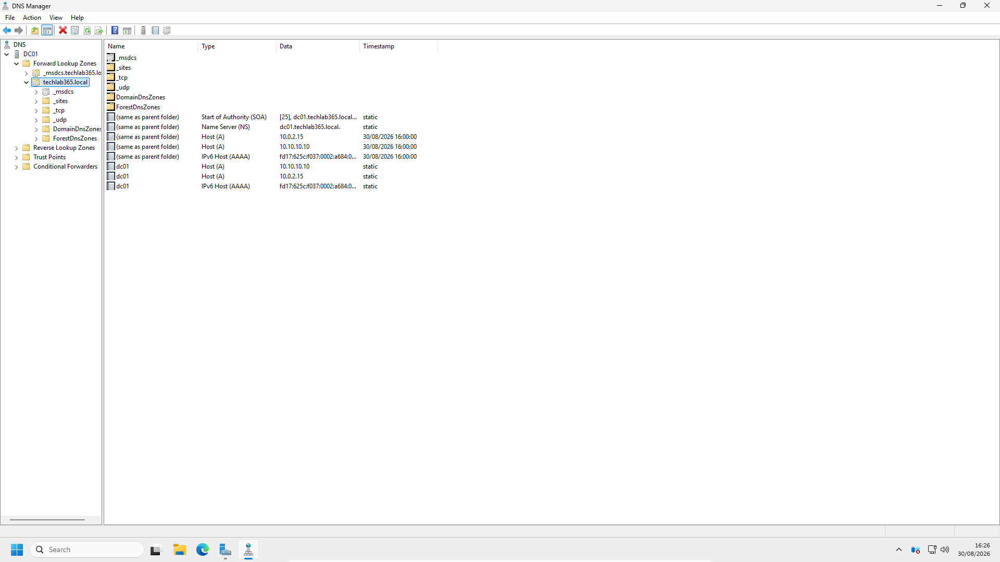
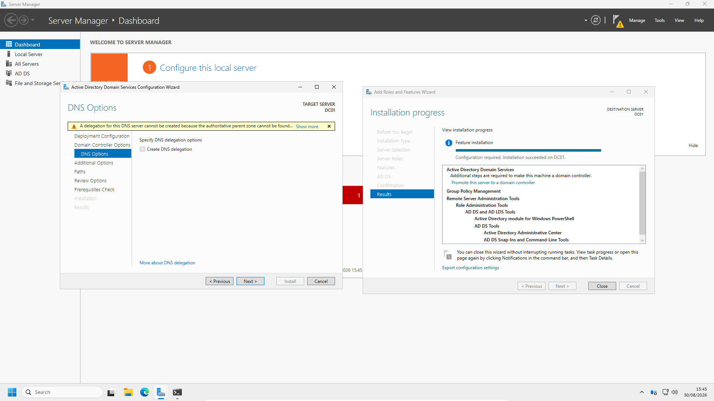

# Installing Active Directory Domain Services

## Introduction

With the Windows Server 2025 virtual machine prepared in the previous chapters, the next stage of the laboratory was to install and configure **Active Directory Domain Services (AD DS)**.

The objective of this chapter is not simply to install a server role. The Windows Server must be promoted to a Domain Controller and configured to provide the identity and directory infrastructure required for the rest of the Active Directory laboratory.

For this laboratory, `DC01` was promoted as the first Domain Controller and a new Active Directory forest was created using the domain name:

```text
techlab365.local
```

DNS was installed as part of the Domain Controller deployment because Active Directory relies heavily on DNS to locate Domain Controllers and other domain services.

By the end of this chapter, the standalone Windows Server installation had become the first Domain Controller in the `techlab365.local` Active Directory environment.

---

# Objectives

After completing this chapter, I will be able to:

- Install the Active Directory Domain Services server role.
- Promote a Windows Server to a Domain Controller.
- Create a new Active Directory forest.
- Create the `techlab365.local` domain.
- Configure the Directory Services Restore Mode (DSRM) password.
- Verify the successful creation of the Active Directory domain.
- Verify the Active Directory forest configuration.
- Verify that DNS was installed as part of the Domain Controller deployment.
- Confirm that the core Domain Controller services are running.
- Perform basic Domain Controller health checks using PowerShell and `dcdiag`.

---

# Prerequisites

Before starting this chapter, ensure that:

- Windows Server 2025 has been installed successfully.
- The server has been renamed to `DC01`.
- The server has been configured with the required network adapters.
- The `AD-Lab` network is configured.
- The server internal network adapter uses the static address `10.10.10.10`.
- Basic network connectivity has been verified.
- Windows Server is ready for its Active Directory role.

The preparation of the Windows Server environment was completed in the previous chapters.

---

# Lab Configuration

The Active Directory environment was configured using the following values:

| Component | Configuration |
|---|---|
| Server Name | `DC01` |
| Server Operating System | Windows Server 2025 |
| Domain Name | `techlab365.local` |
| Forest Name | `techlab365.local` |
| Domain Controller | `DC01.techlab365.local` |
| Internal Network | `AD-Lab` |
| Domain Controller IP | `10.10.10.10` |

This server becomes the first Domain Controller in the forest and provides the foundation for the remaining Active Directory administration tasks.

---

# Active Directory Domain Services Overview

**Active Directory Domain Services (AD DS)** is Microsoft's directory service for Windows domain environments.

It provides a centralised database used to manage:

- Users
- Computers
- Groups
- Authentication
- Authorisation
- Organisational Units
- Security policies

Installing the AD DS role adds the components required to run Active Directory. However, installing the role alone does not make the server a Domain Controller.

The server must then be promoted and configured as part of an Active Directory forest.

In this laboratory, `DC01` is the first Domain Controller and therefore creates the initial `techlab365.local` forest.

---

# Installing the Active Directory Domain Services Role

The installation was started from **Server Manager**.

The server role installation wizard was opened using:

```text
Manage → Add Roles and Features
```

The standard role-based installation option was selected because Active Directory Domain Services was being installed on the local server.


The **Active Directory Domain Services** role was then selected.

The installation wizard automatically identified the management tools required for the role. These were included as part of the installation.

At this stage, the server receives the AD DS components, but it is not yet a Domain Controller.

---

# Completing the AD DS Role Installation

The Active Directory Domain Services role installation was completed successfully.



After the role installation completed, Server Manager displayed the post-deployment configuration notification.

This notification provides access to:

```text
Promote this server to a domain controller
```

Selecting this option starts the **Active Directory Domain Services Configuration Wizard**.

The role installation and Domain Controller promotion are separate stages. This distinction is important because a Windows Server can have the AD DS role installed without yet hosting an Active Directory domain.

---

# Promoting DC01 to a Domain Controller

The server was promoted using the **Active Directory Domain Services Configuration Wizard**.

Because this laboratory did not have an existing Active Directory environment, the option to create a new forest was selected.

The root domain name was configured as:

```text
techlab365.local
```

Creating a new forest also creates the first Active Directory domain.

The resulting structure is:

```text
Forest: techlab365.local
Domain: techlab365.local
Domain Controller: DC01
```

---

# Configuring the Domain Controller

During the Domain Controller promotion process, the required configuration options were reviewed.

The server was configured as:

- A Domain Controller.
- A DNS Server.
- A Global Catalog server.

A **Directory Services Restore Mode (DSRM)** password was also configured.

The DSRM password is separate from the normal domain Administrator password and is used for specific Active Directory recovery and maintenance scenarios.



The remaining configuration options were reviewed before continuing with the installation.

---

# Running the Prerequisites Check

Before the promotion process was completed, the Active Directory Domain Services Configuration Wizard performed a prerequisite check.

The prerequisite check verifies whether the server configuration is suitable for promotion to a Domain Controller.



The prerequisite checks completed successfully, allowing the installation to continue.

After confirming the configuration, Windows installed the required Active Directory components and configured the server as a Domain Controller.

The server automatically restarted to complete the promotion process.

---

# Verifying the Domain Controller

After the restart, Server Manager displayed the infrastructure roles installed on the server.

These included:

- AD DS
- DNS
- File and Storage Services



This provided an initial confirmation that the server had been successfully configured with the Domain Controller infrastructure.

---

# Verifying the Active Directory Domain

The **Active Directory Users and Computers** console was opened to verify the newly created domain.

The `techlab365.local` domain was available together with the default Active Directory containers.



The default structure includes containers such as:

- Builtin
- Computers
- Domain Controllers
- Users
- Managed Service Accounts
- Foreign Security Principals

These containers provide the initial Active Directory structure that will be used and expanded during the following administration chapters.

---

# Verifying the Active Directory Domain and Forest

PowerShell was used to verify the Active Directory domain and forest configuration.

The following command was used:

```powershell
Get-ADDomain
```

The command confirmed the domain configuration for `techlab365.local`.

The following command was then used:

```powershell
Get-ADForest
```


The output confirmed that:

- The domain is `techlab365.local`.
- The forest is `techlab365.local`.
- `DC01.techlab365.local` is the Domain Naming Master.
- `DC01.techlab365.local` is the Schema Master.
- The forest contains the newly created domain.

These commands provide a useful administrative method for verifying the logical Active Directory structure without relying only on graphical tools.

---

# Verifying Domain Controller Services

The core services required by the Domain Controller were verified using PowerShell.

The following command was used:

```powershell
Get-Service NTDS,DNS,Netlogon | Select-Object Name, Status, StartType
```



The output confirmed that the following services were running and configured to start automatically:

- `NTDS` – Active Directory Domain Services
- `DNS` – DNS Server
- `Netlogon` – Net Logon

These services are fundamental to the operation of the Domain Controller.

---

# Verifying DNS Configuration

DNS Manager was opened to verify the DNS configuration created during the Domain Controller deployment.

The DNS server `DC01` was available and the following management areas were present:

- Forward Lookup Zones
- Reverse Lookup Zones
- Trust Points
- Conditional Forwarders



The forward lookup zones included:

- `_msdcs.techlab365.local`
- `techlab365.local`

These Active Directory-integrated zones were created as part of the Domain Controller and DNS deployment.

---

# Reviewing DNS Zone Records

The `techlab365.local` forward lookup zone was opened to review the records created during the Active Directory installation.



The zone contains important records including:

- Start of Authority (SOA)
- Name Server (NS)
- Host (A) records
- IPv6 Host (AAAA) records

The DNS structure also contains folders such as:

- `_msdcs`
- `_sites`
- `_tcp`
- `_udp`

These contain records used by Active Directory and other domain services to locate the Domain Controller and associated services.

---

# Reviewing DNS Server Options

The DNS server configuration was also reviewed to confirm that the DNS role was installed and available for administration.



DNS is a critical dependency for Active Directory because clients use DNS to locate services such as:

- Domain Controllers
- LDAP services
- Kerberos authentication services
- Global Catalog servers

For this reason, DNS configuration and Active Directory administration are closely linked.

---

# Additional Domain Controller Health Checks

After the main installation was verified, additional PowerShell and diagnostic checks were performed.

The following command was used:

```powershell
dcdiag
```

The diagnostic successfully passed the core connectivity and Active Directory tests, including:

- Connectivity
- Advertising
- SysVolCheck
- NetLogons
- Replications
- Services
- LocatorCheck

The diagnostic also reported warnings in the DFS Replication and System logs. Rather than ignoring these results, additional checks were performed to confirm the current status of the relevant services and domain shares.

The DFS Replication service was checked using:

```powershell
Get-Service DFSR | Select-Object Name, Status, StartType
```

The output confirmed that DFSR was:

```text
Status:    Running
StartType: Automatic
```

The DFSR migration state was checked using:

```powershell
dfsrmig /getglobalstate
```

The output returned:

```text
Current DFSR global state: 'Eliminated'
```

The required domain shares were then verified:

```powershell
Get-SmbShare -Name SYSVOL,NETLOGON | Select-Object Name, Path, Description
```

The output confirmed that both shares were present:

- `SYSVOL`
- `NETLOGON`

These checks confirmed that the DFS Replication service was running and that the required Domain Controller shares were available.

---

# Verification

The Active Directory deployment was considered successful after confirming that:

- Active Directory Domain Services was installed.
- `DC01` was promoted to a Domain Controller.
- A new Active Directory forest was created.
- The `techlab365.local` domain was created.
- DNS was installed as part of the Domain Controller deployment.
- Active Directory Users and Computers displayed the new domain.
- `Get-ADDomain` confirmed the Active Directory domain.
- `Get-ADForest` confirmed the Active Directory forest.
- The NTDS service was running.
- The DNS service was running.
- The Netlogon service was running.
- Active Directory-integrated DNS zones were available.
- DNS records created during the domain deployment were visible.
- The DFSR service was running.
- The SYSVOL share was available.
- The NETLOGON share was available.

The Windows Server environment is now operating as the first Domain Controller for the `techlab365.local` Active Directory laboratory.

---

# Key Learnings

During this chapter, I learned that:

- Active Directory Domain Services provides centralised identity and access management for Windows domain environments.
- Installing the AD DS role alone does not make a server a Domain Controller.
- A server must be promoted after the AD DS role installation.
- The first Domain Controller can create a new forest and root domain.
- DNS is closely integrated with Active Directory and is required for service discovery.
- The DSRM password is used for Active Directory recovery scenarios.
- Active Directory Users and Computers provides a graphical view of the domain structure.
- `Get-ADDomain` and `Get-ADForest` can be used to verify the Active Directory environment from PowerShell.
- Services such as NTDS, DNS and Netlogon are essential to Domain Controller operation.
- Active Directory creates DNS records that allow clients and services to locate domain resources.
- SYSVOL and NETLOGON are important shares provided by a functioning Domain Controller.
- `dcdiag` can be used as part of a structured Domain Controller diagnostic process.

---

# Skills Demonstrated

During this chapter, I demonstrated practical experience in:

- Windows Server role installation.
- Active Directory Domain Services deployment.
- Domain Controller promotion.
- Active Directory forest creation.
- Active Directory domain creation.
- DNS integration.
- Directory Services Restore Mode configuration.
- Active Directory Users and Computers.
- DNS Manager.
- PowerShell Active Directory commands.
- Domain and forest verification.
- Windows service verification.
- Domain Controller diagnostics.
- DFSR service verification.
- SYSVOL and NETLOGON verification.
- Producing technical documentation using GitHub and Markdown.

---

# Interview Tip

For a First Line or IT Support role, it is useful to understand the difference between installing Active Directory Domain Services and promoting a server to a Domain Controller.

A useful way to describe this laboratory experience in an interview is:

> “I built an Active Directory environment in my Windows Server 2025 lab by installing the Active Directory Domain Services role and then promoting the server to the first Domain Controller in a new forest. I created the techlab365.local domain, configured DNS as part of the deployment and verified the environment using Active Directory Users and Computers, DNS Manager, PowerShell and Domain Controller service checks.”

This demonstrates practical familiarity with the deployment and verification of an Active Directory environment rather than only theoretical knowledge.

---

# Chapter Summary

In this chapter, the Windows Server 2025 virtual machine was transformed from a standalone server into the first Domain Controller for the TechLab365 Active Directory laboratory.

The Active Directory Domain Services role was installed and `DC01` was promoted to create a new Active Directory forest and the `techlab365.local` domain. DNS was installed as part of the Domain Controller deployment.

After the server restarted, the installation was verified using Server Manager, Active Directory Users and Computers, DNS Manager and PowerShell. The domain and forest configuration were confirmed, the core Domain Controller services were verified as running and the Active Directory-integrated DNS zones and records were reviewed.

Additional diagnostic checks confirmed that DFSR was running and that the SYSVOL and NETLOGON shares were available.

The Active Directory infrastructure is now ready for the next stage of the laboratory: administering users, groups, computers and organisational units.

---

# Next Chapter

Continue directly to:

**[Chapter 7 – Active Directory Administration](../07-Active-Directory-Administration/Active-Directory-Administration.md)**
