# Active Directory Administration

## Introduction

With the `techlab365.local` Active Directory domain successfully deployed in the previous chapter, the next stage of the laboratory focuses on the practical administration of the directory environment.

Installing Active Directory Domain Services creates the directory infrastructure, but the day-to-day value of Active Directory comes from the administration of the objects stored inside it. In a typical Windows domain, administrators need to create and manage user accounts, organise objects, maintain group membership, reset passwords and respond to account access issues.

This chapter therefore moves from **deploying Active Directory** to **using Active Directory as an administrator**.

For this laboratory, **Active Directory Users and Computers (ADUC)** was used to manage the domain structure, Organisational Units, users and security groups. **Group Policy Management** was also used to configure a domain Account Lockout Policy and introduce a realistic Service Desk support scenario.

By the end of this chapter, the `techlab365.local` environment contains a structured organisational hierarchy, departmental security groups and user accounts representing a small organisation.

The chapter also demonstrates common First Line and Service Desk tasks, including password resets, disabling accounts and responding to account lockout scenarios.

---

# Objectives

After completing this chapter, I will be able to:

- Understand the purpose of Active Directory Users and Computers.
- Review the default Active Directory domain structure.
- Understand the difference between default containers and Organisational Units.
- Explain the purpose of an Organisational Unit (OU).
- Create a logical OU structure for an organisation.
- Create and manage Active Directory user accounts.
- Create departmental security groups.
- Add users to security groups.
- Review group membership from both the group and user perspectives.
- Reset a user password.
- Disable and re-enable a user account.
- Configure a domain Account Lockout Policy.
- Verify the configured account lockout settings.
- Understand a common locked-account Service Desk scenario.

---

# Prerequisites

Before starting this chapter, ensure that:

- Windows Server 2025 has been installed successfully.
- The server has been promoted to a Domain Controller.
- The `techlab365.local` Active Directory domain has been created.
- DNS is operational.
- Active Directory Users and Computers is available.
- Group Policy Management is available.

The Active Directory infrastructure was deployed and verified in the previous chapter.

---

# Lab Configuration

The Active Directory administration environment used the following configuration:

| Component | Configuration |
|---|---|
| Server Name | `DC01` |
| Server Operating System | Windows Server 2025 |
| Domain | `techlab365.local` |
| Domain Controller | `DC01.techlab365.local` |
| Administration Tools | Active Directory Users and Computers, Group Policy Management |

---

# Active Directory Administration Overview

Active Directory provides a centralised directory service for managing identities and resources within a Windows domain environment.

Once a Domain Controller has been deployed, administrators can manage objects such as:

- Users
- Computers
- Groups
- Organisational Units
- Service accounts
- Authentication settings
- Security policies

For a First Line IT Support or Service Desk role, the most common day-to-day Active Directory tasks are usually related to user identity and access management.

Examples include:

- Creating a new user account.
- Resetting a forgotten password.
- Unlocking an account.
- Enabling or disabling an account.
- Adding a user to a security group.
- Removing access when a user changes department or leaves the organisation.
- Checking whether an account is locked or disabled.

The purpose of this chapter is to practise these tasks in a structured domain environment rather than only learning the concepts theoretically.

---

# Active Directory Users and Computers

**Active Directory Users and Computers (ADUC)** is one of the primary Microsoft Management Console tools used to administer objects stored in Active Directory.

It provides a graphical interface for managing:

- User accounts
- Computer accounts
- Security groups
- Distribution groups
- Organisational Units
- Group membership
- Account properties

The console can be opened from:

```text
Server Manager
→ Tools
→ Active Directory Users and Computers
```

For many administrative tasks, ADUC provides a practical graphical interface that is commonly used by system administrators and support teams.

---

# Reviewing the Default Active Directory Domain Structure

The `techlab365.local` domain was reviewed using **Active Directory Users and Computers**.

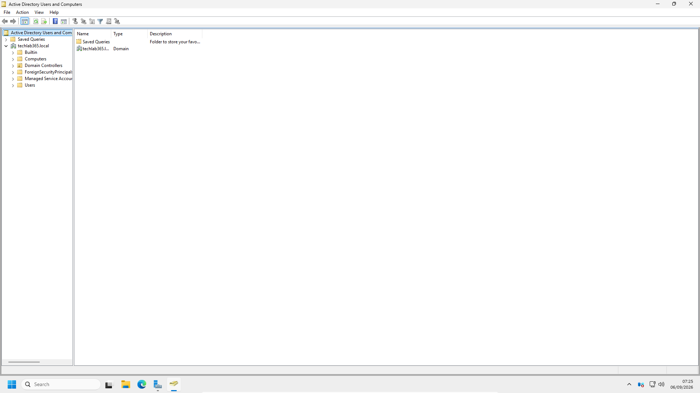

A newly created Active Directory domain contains several default containers and organisational areas, including:

- Builtin
- Computers
- Domain Controllers
- ForeignSecurityPrincipals
- Managed Service Accounts
- Users

These objects are created automatically as part of the Active Directory domain infrastructure.

Some of these locations have specific technical purposes. For example:

- **Builtin** contains built-in security groups.
- **Computers** is the default location for domain-joined computer objects.
- **Domain Controllers** contains the computer objects representing Domain Controllers.
- **Users** contains several built-in users and groups.

Although the default structure is functional, a real organisation usually requires a clearer structure to organise its own users and computers.

This is where **Organisational Units** become important.

---

# Understanding Organisational Units (OUs)

An **Organisational Unit (OU)** is a logical container within Active Directory that can be used to organise directory objects.

An OU can contain objects such as:

- Users
- Computers
- Groups
- Other OUs

For example, an organisation could create OUs based on:

- Departments
- Locations
- Business functions
- Device types
- Administrative responsibilities

A simple company structure could look like:

```text
techlab365.local
│
├── Users
│   ├── IT Support
│   ├── HR
│   └── Finance
│
├── Computers
│
└── Servers
```

The important point is that an OU is not simply a folder created for visual organisation.

OUs are useful because they can also be used to:

- Apply Group Policy to a specific set of users or computers.
- Delegate administrative permissions.
- Separate objects according to organisational requirements.
- Create a logical and scalable Active Directory structure.

For example, a company could apply one Group Policy to the `Computers` OU and a different policy to the `Servers` OU.

Similarly, administrative responsibility could be delegated so that a department administrator can manage users inside a specific OU without receiving full Domain Administrator permissions.

---

# Containers vs Organisational Units

The default Active Directory structure contains both containers and Organisational Units.

Although they can appear similar in ADUC, they serve different purposes.

A simplified comparison is:

| Feature | Default Container | Organisational Unit |
|---|---|---|
| Stores Active Directory objects | Yes | Yes |
| Can organise objects | Yes | Yes |
| Can be used for standard OU-based Group Policy linking | Limited / not the normal design approach | Yes |
| Can be used for administrative delegation | Not the primary purpose | Yes |
| Created by administrators for organisational design | Usually system-defined | Yes |

For this reason, organisations commonly create their own OU structure rather than placing all users and computers into the default containers.

The OU design should reflect the needs of the organisation and should remain simple enough to administer.

---

# Creating the Organisational Unit Structure

A custom Organisational Unit structure was created for the TechLab365 environment.

The structure included dedicated OUs for:

- Users
- Computers
- Servers

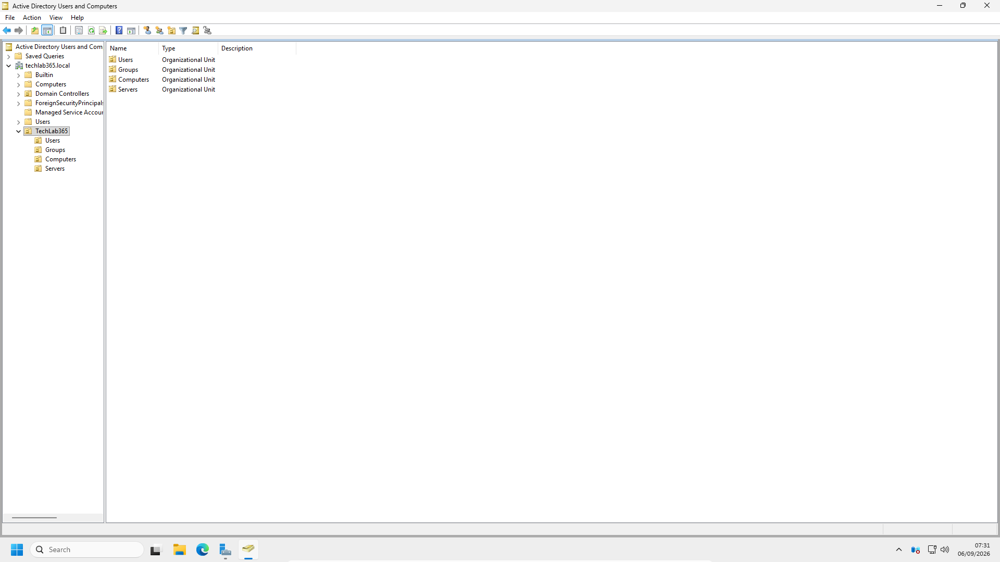

Creating these OUs provides a clearer separation between different types of Active Directory objects.

For example:

- User accounts can be stored in the `Users` OU.
- Domain workstations can later be organised in the `Computers` OU.
- Server computer objects can be organised separately in the `Servers` OU.

This structure will also provide a foundation for later chapters involving Group Policy and domain administration.

At this stage, the OU structure is intentionally simple. In a real production environment, the structure could later be expanded to include departments, locations or other administrative requirements.

---

# Understanding Security Groups

A **security group** is an Active Directory object used to manage permissions and access for multiple users.

Instead of assigning access individually to every employee, users can be placed into a group representing a role or department.

For example:

```text
User → Member of Security Group → Security Group receives permission → User receives access
```

This approach is more scalable than assigning permissions directly to individual users.

A practical example would be:

```text
IT Support Group
    ├── John Smith
    ├── Michael Brown
    └── Antonio Gabriele Rizzo
```

If access to a resource is assigned to the **IT Support** security group, the members can receive access through their group membership.

This simplifies administration because changes can be managed by adding or removing users from the group.

---

# Creating Departmental Security Groups

Security groups were created to represent different departments within the TechLab365 organisation.

The groups included:

- IT Support
- HR
- Finance

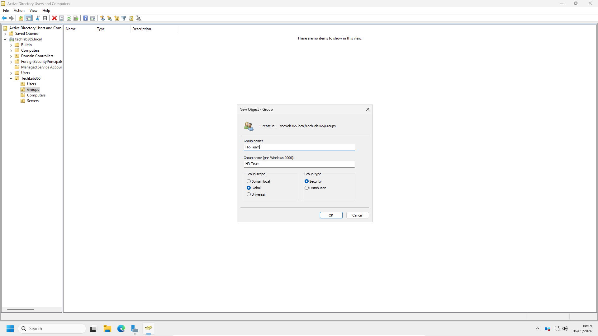

The groups provide a logical method of organising users according to their role or department.

In a production environment, these groups could later be used to control access to:

- Shared folders
- Applications
- Printers
- Other network resources

The principle is important for access management: permissions should normally be assigned to groups where possible, rather than repeatedly assigning permissions directly to individual user accounts.

---

# Creating Active Directory User Accounts

Several user accounts were created to simulate employees within the TechLab365 environment.

The user creation process includes entering the identity information required for the account and defining the initial sign-in name.

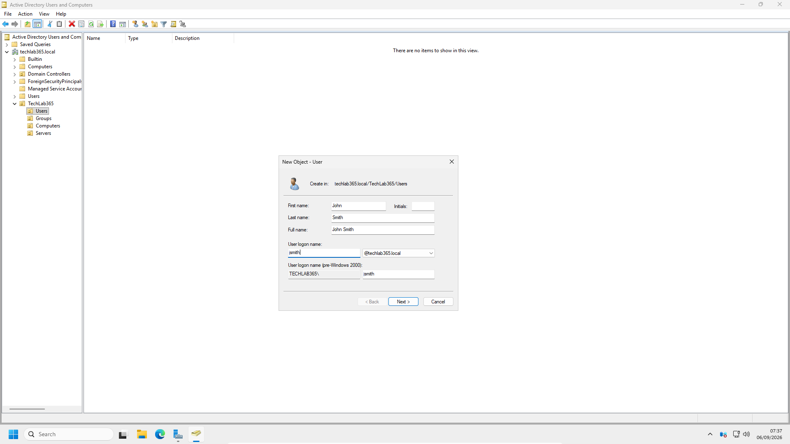

After creation, the user accounts were visible within Active Directory Users and Computers.

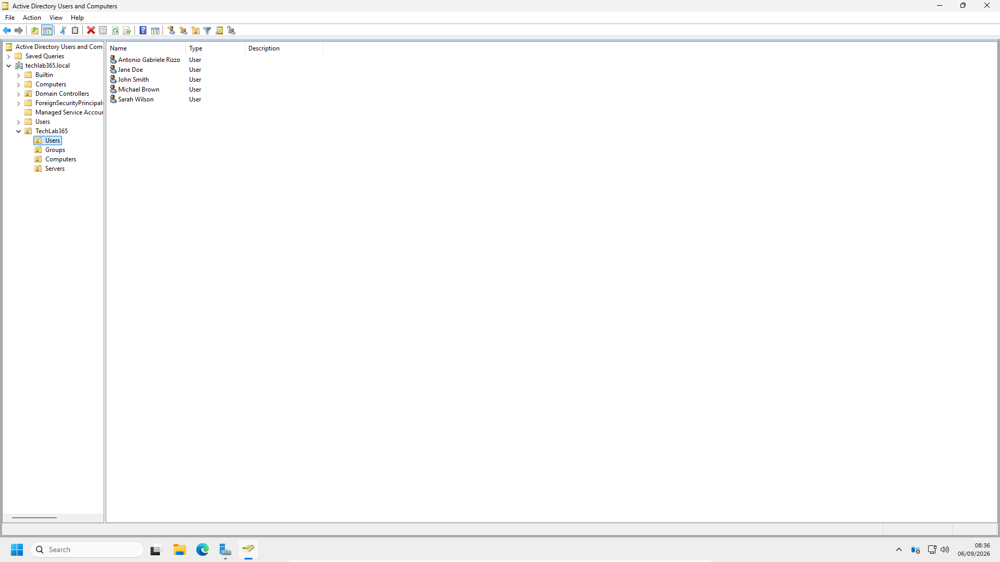

The laboratory user accounts include:

- John Smith
- Jane Doe
- Michael Brown
- Sarah Wilson
- Antonio Gabriele Rizzo

Creating user accounts is one of the most common Active Directory administration tasks.

However, creating the account is only the beginning of the user lifecycle. Administrators may later need to:

- Reset the password.
- Change group membership.
- Disable the account.
- Re-enable the account.
- Unlock the account.
- Remove the account when it is no longer required.

---

# Managing Departmental Group Membership

After creating the departmental security groups and user accounts, users were assigned to the appropriate groups.

This demonstrates the relationship between an individual user account and the security groups used to manage access.

---

## IT Support Group

The IT Support group membership was reviewed after adding the appropriate users.


This group represents users who belong to the IT Support function.

In a real environment, the group could later be granted access to technical resources or administrative tools according to the principle of least privilege.

---

## HR Group

The HR group was configured with the appropriate departmental membership.

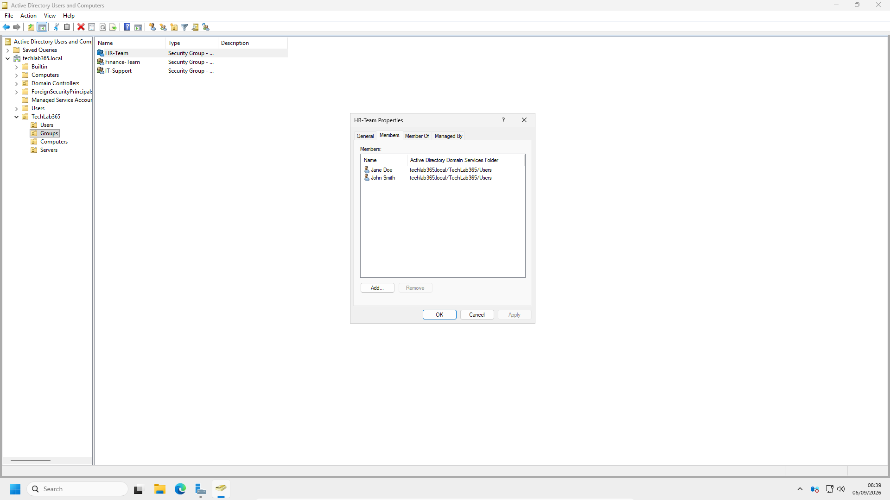

Using a dedicated security group makes it easier to manage department-based access.

When an employee joins or leaves HR, the administrator can update the group membership instead of individually modifying permissions across multiple resources.

---

## Finance Group

The Finance group was also configured to represent a separate department.

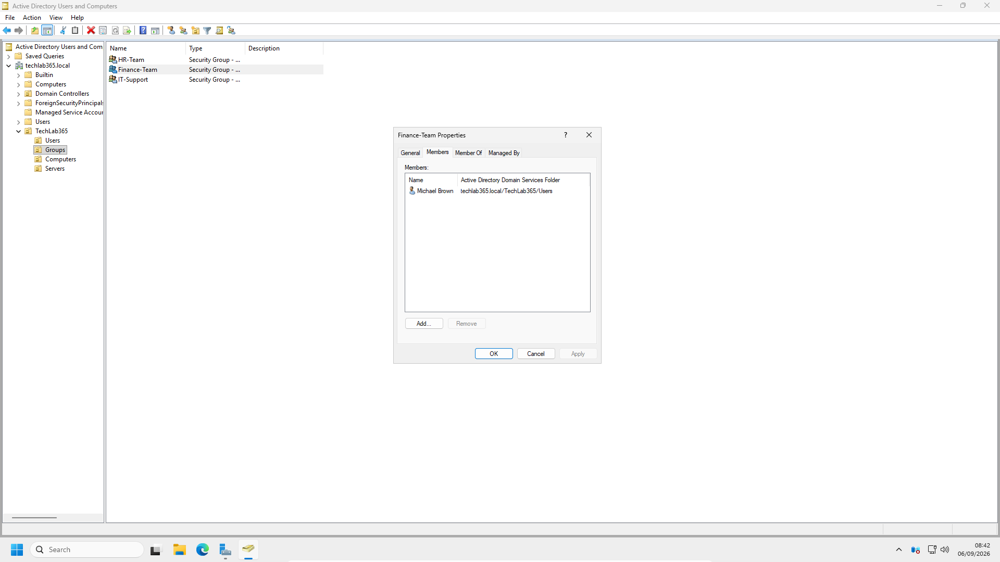

Separating departments into dedicated security groups creates a foundation for role-based access management.

For example, a future file server could grant a Finance shared folder to the Finance security group without needing to assign permissions separately to each user.

---

# Reviewing Group Membership from the User Perspective

Group membership can also be reviewed directly from an individual user account.

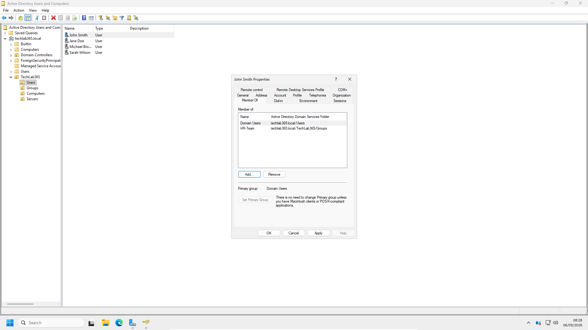

This is useful when troubleshooting access issues.

For example, a user may report:

> “I cannot access the department shared folder, but my colleague can.”

A structured troubleshooting approach could include checking:

1. Whether the user account is enabled.
2. Whether the user is a member of the correct security group.
3. Whether the security group has the required permission.
4. Whether the user needs to sign out and sign in again before updated credentials are used.

Understanding how to check group membership is therefore relevant to common First Line support scenarios.

---

# Password Reset Scenario

One of the most common Service Desk requests is:

> “I forgot my password and cannot sign in.”

To simulate this scenario, the password for **Michael Brown** was reset using Active Directory Users and Computers.

The password reset process was initiated from the user account context menu.

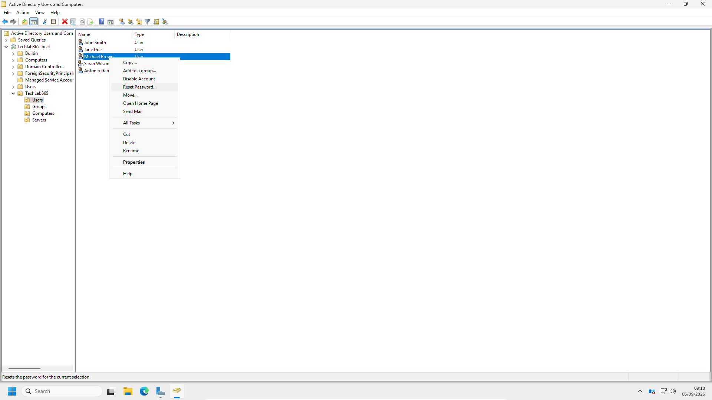

The new password and the relevant account options were then configured.

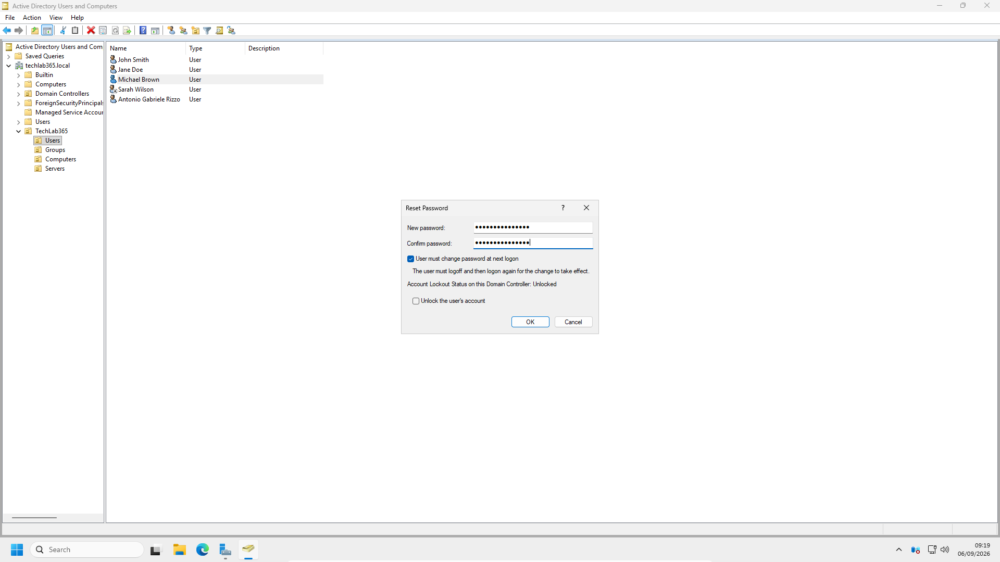

After completing the operation, Active Directory confirmed that the password had been successfully changed.

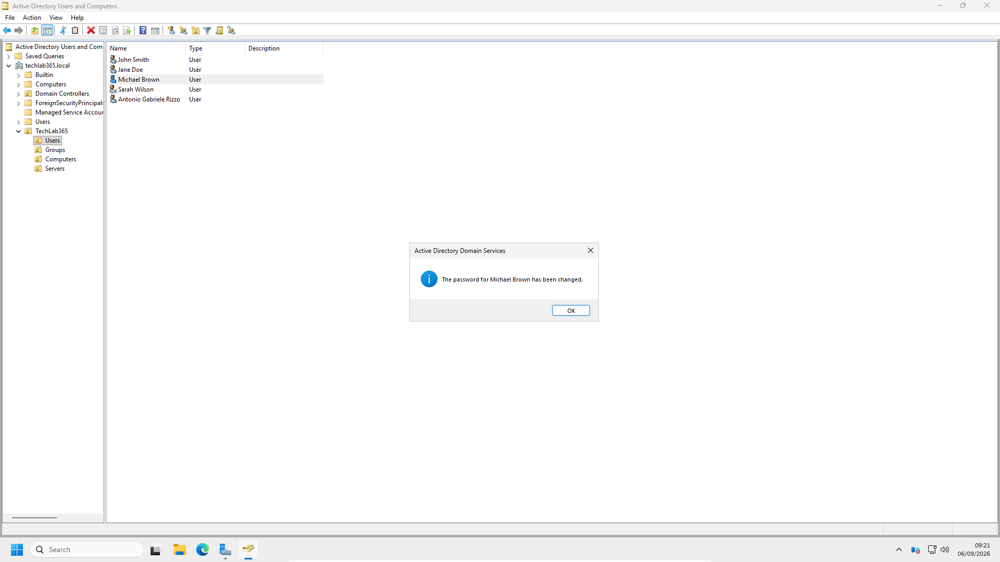

In a real organisation, a Service Desk analyst should not reset a password simply because somebody requests it.

The user's identity should first be verified according to the organisation's security procedures.

Depending on company policy, this may include:

- Identity verification questions.
- Confirmation through a registered contact method.
- Approval from a manager.
- Multi-factor authentication recovery procedures.

The technical action is simple, but the security process surrounding it is equally important.

---

# Disabling a User Account

Another common Active Directory administration task is disabling a user account.

An account may need to be disabled when:

- An employee leaves the organisation.
- Access needs to be temporarily suspended.
- A security investigation is required.
- The account is no longer authorised to authenticate.

For this scenario, the account belonging to **Sarah Wilson** was disabled.

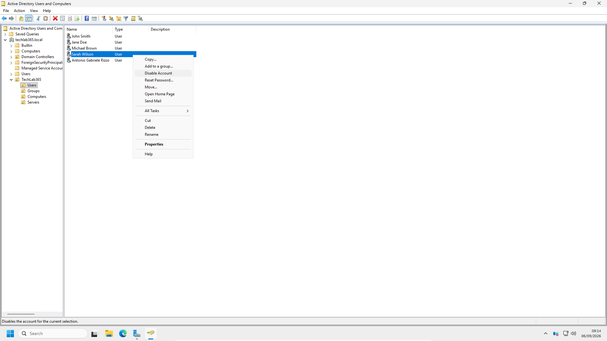

Active Directory then confirmed that the account had been disabled.


Disabling an account prevents the user from authenticating while retaining the Active Directory object and its associated information.

This is different from deleting an account.

A disabled account can later be reviewed, restored to service or permanently removed according to organisational procedures.

---

# Configuring the Account Lockout Policy

Another common Service Desk scenario occurs when a user repeatedly enters an incorrect password and becomes locked out.

To create a realistic laboratory scenario, an **Account Lockout Policy** was configured through **Group Policy Management**.

The policy is located at:

```text
Computer Configuration
→ Policies
→ Windows Settings
→ Security Settings
→ Account Policies
→ Account Lockout Policy
```

The Account Lockout Policy controls what happens when repeated invalid sign-in attempts are detected.

The following settings were configured:

| Policy | Configuration |
|---|---|
| Account lockout threshold | 5 invalid logon attempts |
| Account lockout duration | 30 minutes |
| Reset account lockout counter after | 30 minutes |
| Allow Administrator account lockout | Enabled |

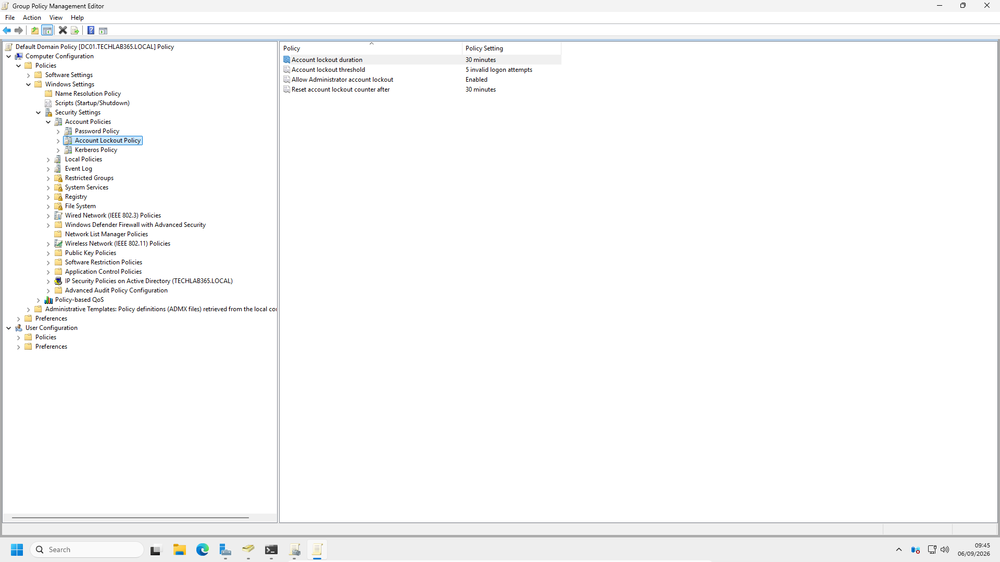

---

# Understanding the Account Lockout Settings

The three main settings work together.

### Account lockout threshold

This defines how many invalid sign-in attempts are allowed before the account becomes locked.

For this laboratory:

```text
5 invalid logon attempts
```

After the fifth invalid attempt, the account can enter a locked state.

### Account lockout duration

This defines how long the account remains locked before it is automatically unlocked.

For this laboratory:

```text
30 minutes
```

### Reset account lockout counter after

This defines how long Windows waits before resetting the count of invalid sign-in attempts.

For this laboratory:

```text
30 minutes
```

A 30-minute duration provides a more realistic demonstration than a very short testing period while remaining practical for a home laboratory.

The selected values are not intended to represent a universal production standard. Real organisations configure these settings according to their security requirements, risk profile and support procedures.

---

# Verifying the Account Lockout Policy

After configuring the policy, the settings were reviewed to confirm that the configuration had been successfully applied.

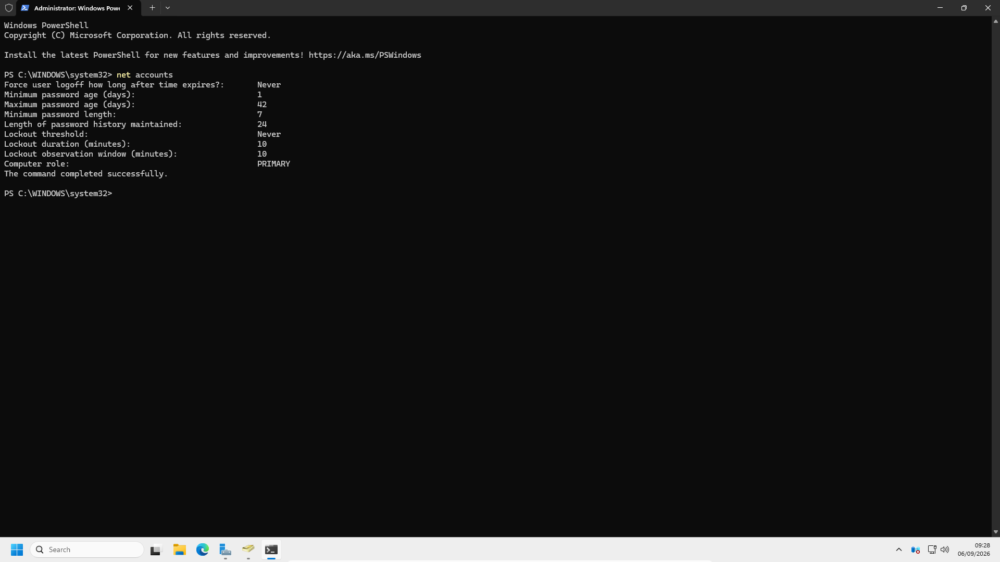

The final configuration confirmed:

- 5 invalid logon attempts.
- 30-minute account lockout duration.
- 30-minute reset counter period.
- Administrator account lockout enabled.

This verification step is important because changing a policy is not the same as confirming that the intended configuration is present.

---

# Locked Account Service Desk Scenario

A typical Service Desk request could be:

> “I forgot my password and entered the wrong password too many times. Now I cannot log in.”

This situation should not automatically be treated as only a password problem.

The administrator should consider several possible causes:

- The user may have forgotten the password.
- The account may be locked.
- The account may be disabled.
- The password may have expired.
- The user may be using an old password saved on another device.

A structured troubleshooting process could therefore include:

1. Verify the user's identity according to company procedures.
2. Check whether the account is enabled.
3. Check whether the account is locked.
4. Reset the password if required.
5. Unlock the account if required.
6. Confirm that the user is authorised to access the service.
7. Ask the user to attempt to sign in again.
8. Investigate repeated lockouts if the account immediately becomes locked again.

The final point is particularly important.

If an account repeatedly locks immediately after being unlocked, the root cause may be a device, application or service that continues attempting authentication with an old stored password.

The correct troubleshooting approach is therefore to identify the cause rather than repeatedly unlocking the account.

---

# Client-Side Lockout Testing

The complete user sign-in and lockout scenario will be demonstrated after the Windows 11 workstation has joined the `techlab365.local` domain.

At the current stage of the laboratory, the Windows 11 client has not yet joined the domain.

For this reason, this chapter focuses on:

- Creating the domain policy.
- Verifying the configured settings.
- Understanding the administrative response to a locked account.

A later domain-joined client scenario can demonstrate the full sequence:

```text
User enters incorrect password
        ↓
Invalid attempts reach threshold
        ↓
Domain account becomes locked
        ↓
User contacts Service Desk
        ↓
Account status is investigated
        ↓
Password reset and/or account unlock performed
        ↓
User signs in successfully
```

This separation also keeps the laboratory chapters logically organised: domain administration is completed here, while client domain integration belongs to the next chapter.

---

# Verification

The Active Directory administration tasks were considered successful after confirming that:

- The `techlab365.local` domain structure was accessible in ADUC.
- The default Active Directory containers were reviewed.
- A custom Organisational Unit structure was created.
- Dedicated OUs were created for Users, Computers and Servers.
- Departmental security groups were created.
- User accounts were created successfully.
- Users were assigned to the appropriate security groups.
- Group membership was verified from the group perspective.
- Group membership was reviewed from the user perspective.
- A user password was successfully reset.
- Password reset confirmation was received.
- A user account was successfully disabled.
- The disabled account could be re-enabled when access needed to be restored.
- The Account Lockout Policy was configured.
- The lockout threshold was configured for 5 invalid logon attempts.
- The lockout duration was configured for 30 minutes.
- The lockout counter reset period was configured for 30 minutes.
- The final Account Lockout Policy configuration was reviewed and verified.

The Active Directory environment is now structured and prepared for the next stage of the laboratory.

---

# Key Learnings

During this chapter, I learned that:

- Active Directory Users and Computers provides a graphical interface for administering common Active Directory objects.
- Active Directory administration involves more than simply creating user accounts.
- Default Active Directory containers have specific infrastructure purposes.
- Organisational Units provide a logical structure for organising directory objects.
- OUs can support Group Policy application and administrative delegation.
- Security groups provide a scalable method for managing access.
- Group membership should be used to manage access based on role or department where appropriate.
- Group membership can be checked from both the group and user perspectives.
- Password resets are a common First Line and Service Desk responsibility.
- Identity verification should be performed before changing user credentials.
- Disabling an account preserves the Active Directory object while preventing authentication.
- A disabled account can later be re-enabled when authorised.
- Account Lockout Policies can protect against repeated invalid authentication attempts.
- Account lockouts should be investigated systematically rather than repeatedly unlocking the account without identifying the cause.
- Group Policy can be used to configure domain-wide account security settings.

---

# Skills Demonstrated

During this chapter, I demonstrated practical experience in:

- Active Directory Users and Computers.
- Active Directory object administration.
- Active Directory user account creation.
- Organisational Unit design and administration.
- Understanding OU-based organisation.
- Security group creation.
- Departmental group administration.
- Group membership management.
- User membership verification.
- Password resets.
- User account disabling.
- User account re-enabling.
- Group Policy Management.
- Account Lockout Policy configuration.
- Domain account security configuration.
- Basic identity and access troubleshooting.
- First Line IT Support scenarios.
- Service Desk administration tasks.
- Producing technical documentation using GitHub and Markdown.

---

# Interview Tip

For a First Line or IT Support role, Active Directory administration is frequently listed as a required skill.

A useful way to describe this laboratory experience in an interview is:

> “I built and administered an Active Directory environment in my Windows Server 2025 home lab. I created an organisational structure using OUs, created user accounts and departmental security groups, managed group membership, performed password resets and managed user account status. I also configured a domain Account Lockout Policy using Group Policy Management to simulate a common Service Desk scenario involving repeated incorrect password attempts.”

This demonstrates practical familiarity with common identity and access management tasks rather than only theoretical knowledge.

---

# Chapter Summary

In this chapter, the `techlab365.local` Active Directory environment was used to perform common day-to-day administrative tasks.

The default domain structure was first reviewed before a custom Organisational Unit structure was created. The purpose of OUs was examined not only as a method of organising objects, but also as a foundation for applying Group Policy and delegating administrative responsibilities.

Departmental security groups were then created for IT Support, HR and Finance. User accounts were created and assigned to the appropriate groups, demonstrating how group membership can be used to organise access according to role or department.

Common Service Desk scenarios were also simulated. A password reset was performed for Michael Brown, while Sarah Wilson's account was disabled to demonstrate account lifecycle management and subsequently restored through the account enable process.

Finally, an Account Lockout Policy was configured through Group Policy Management. The policy was configured to lock accounts after five invalid logon attempts for thirty minutes, creating a realistic basis for a future locked-account troubleshooting scenario.

The Active Directory environment is now organised and ready for the next stage of the laboratory: joining the Windows 11 client to the `techlab365.local` domain.

---

# Next Chapter

Continue directly to:

**[Chapter 8 – Joining Windows 11 to the Domain](../08-Joining-Windows-11-to-the-Domain/Joining-Windows-11-to-the-Domain.md)**
