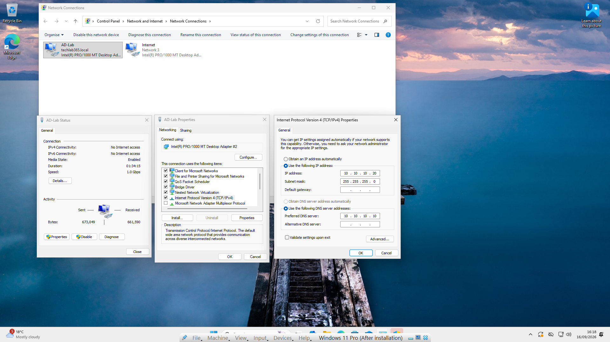
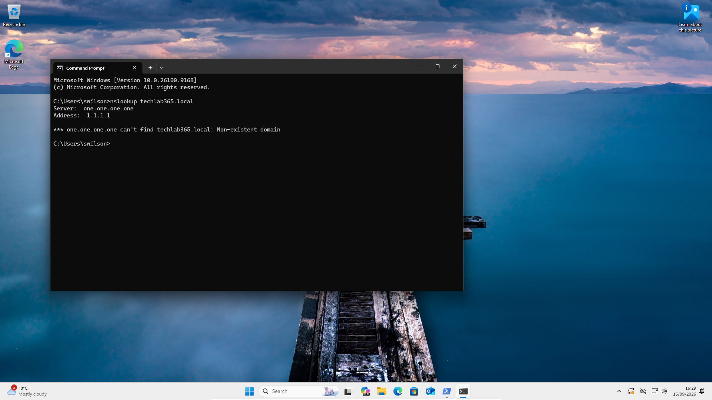
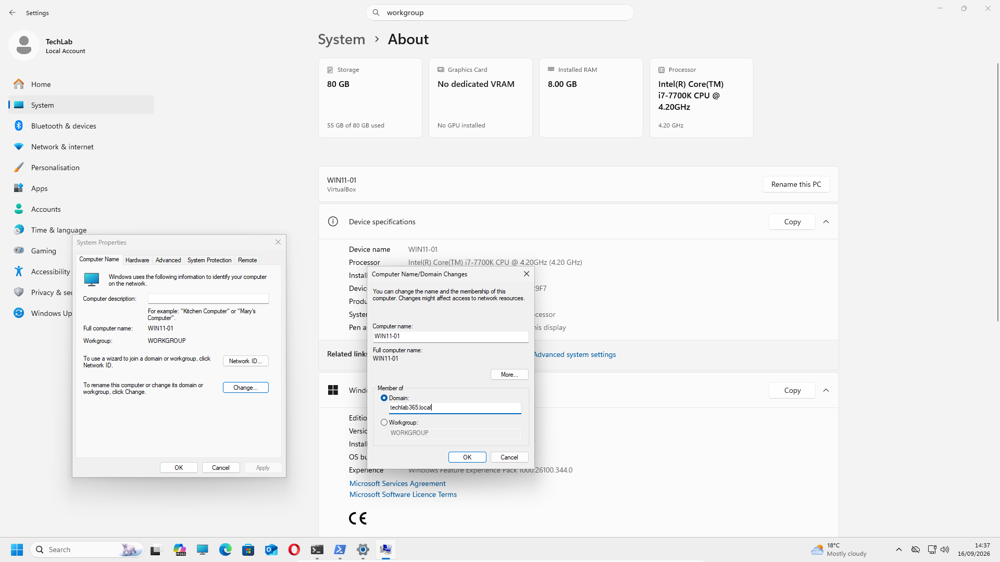
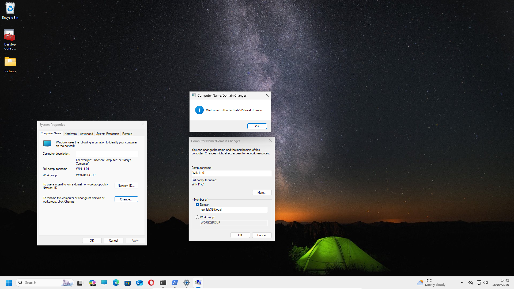
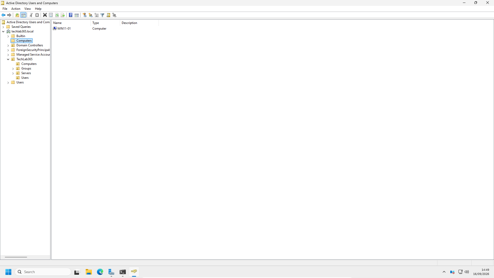
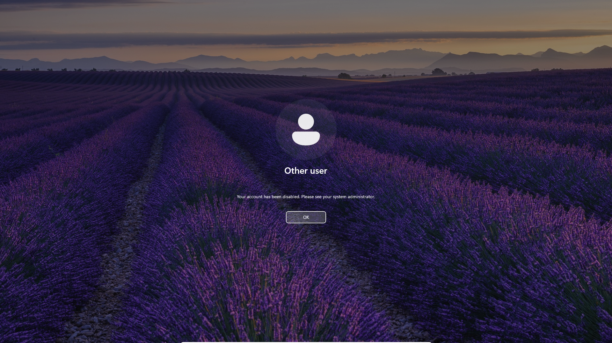
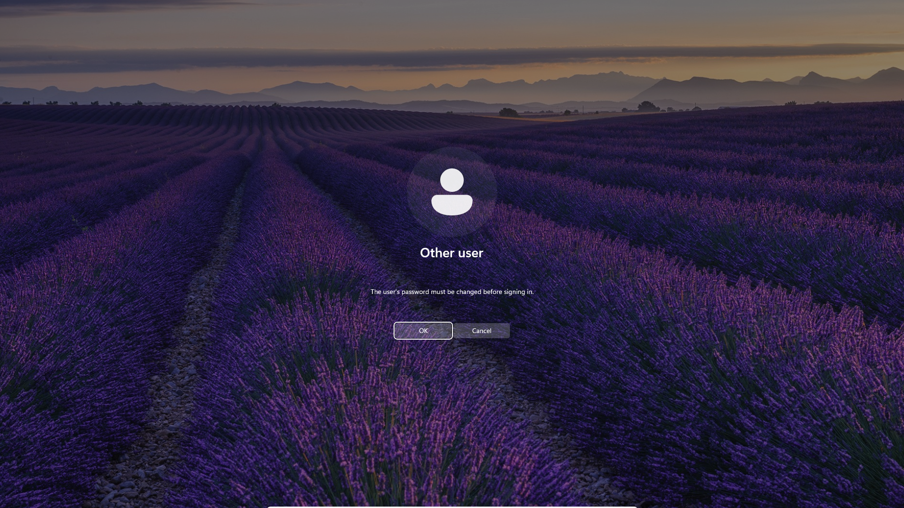
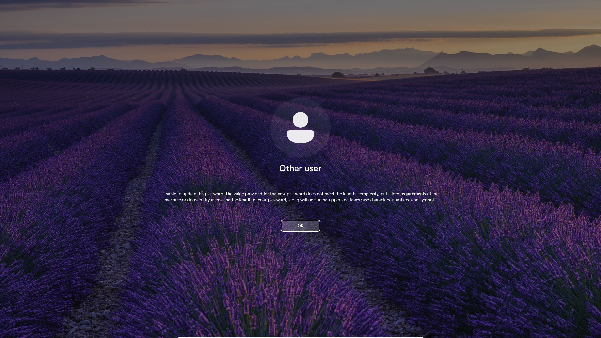
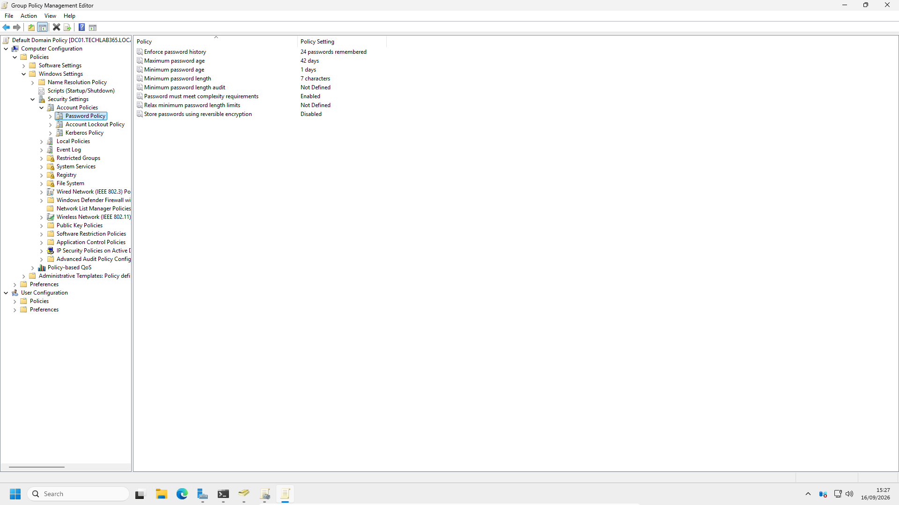
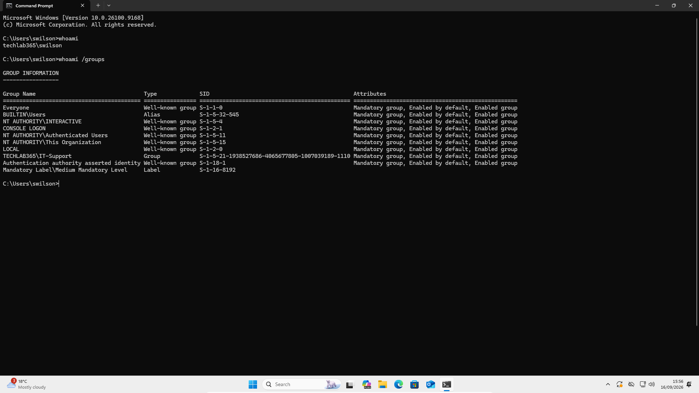

# Joining Windows 11 to the Domain

## Introduction

With the `techlab365.local` Active Directory environment successfully administered in the previous chapter, the next stage of the laboratory focuses on integrating a Windows 11 workstation with the domain.

Joining a workstation to an Active Directory domain allows the computer to use the Domain Controller for centralised authentication and participate in the Windows domain environment. The process also creates a computer account in Active Directory representing the workstation.

This chapter therefore moves from administering Active Directory on the Domain Controller to demonstrating the relationship between **DNS, the Windows client, Active Directory and domain authentication**.

The Windows 11 workstation was configured with a dedicated **AD-Lab** network connection to communicate with the Active Directory environment. DNS resolution and connectivity to the Domain Controller were verified before the workstation was joined to the `techlab365.local` domain.

The chapter also demonstrates a realistic Service Desk authentication scenario using the previously disabled **Sarah Wilson** account. The account was initially rejected because it was disabled. After the account was re-enabled, Windows required a password change. An attempted password was then rejected because of the domain password-complexity requirements. The policy was investigated rather than bypassed, the password was changed successfully, and the final domain authentication was verified from the Windows 11 client.

---

# Objectives

After completing this chapter, I will be able to:

- Understand why DNS is important when joining a Windows client to an Active Directory domain.
- Configure a Windows 11 client to use the Domain Controller for Active Directory DNS resolution.
- Verify DNS resolution between the Windows client and the Active Directory environment.
- Verify network connectivity to the Domain Controller.
- Join a Windows 11 workstation to an Active Directory domain.
- Understand the relationship between a domain-joined workstation and its computer account in Active Directory.
- Verify the computer object created by the domain join.
- Test authentication using an Active Directory domain user.
- Troubleshoot authentication involving a disabled user account.
- Re-enable a disabled Active Directory user account.
- Investigate a password-complexity failure using the domain password policy.
- Verify successful domain authentication and group membership from the Windows client.

---

# Prerequisites

Before starting this chapter, ensure that:

- Windows Server 2025 has been installed successfully.
- The server has been promoted to a Domain Controller.
- The `techlab365.local` Active Directory domain has been created.
- DNS is operational on `DC01`.
- Active Directory Users and Computers is available.
- Windows 11 Pro has been installed.
- The Windows 11 workstation has a network connection to the Active Directory laboratory network.
- The Active Directory user accounts required for the authentication test have already been created.

The Active Directory environment and user accounts were prepared in the previous chapter.

---

# Lab Configuration

The domain integration environment used the following configuration:

| Component | Configuration |
|---|---|
| Domain Controller | `DC01` |
| Domain | `techlab365.local` |
| Domain Controller AD-Lab IP | `10.10.10.10` |
| Windows 11 Host Name | `WIN11-01` |
| Windows 11 AD-Lab IP | `10.10.10.20` |
| Windows 11 AD-Lab DNS | `10.10.10.10` |

The Windows 11 workstation also retained a separate Internet connection. The dedicated **AD-Lab** interface was used for communication with the Active Directory environment, while the Internet interface continued to provide Internet access.

---

# Understanding DNS and Active Directory

DNS is an important dependency for Active Directory.

A Windows client joining a domain does not simply need to know the IP address of the Domain Controller. It needs to locate the domain and the services provided by the Domain Controller through DNS.

For this reason, an Active Directory client should normally use the DNS service associated with the Active Directory environment rather than relying only on a public DNS resolver.

In this laboratory:

```text
Windows 11
    |
    | DNS queries
    v
DC01 - 10.10.10.10
    |
    v
techlab365.local
```

The Windows 11 AD-Lab interface was therefore configured to use:

```text
IP address:       10.10.10.20
Subnet mask:      255.255.255.0
Default gateway:  None
DNS server:       10.10.10.10
```

The absence of a default gateway on this dedicated interface prevents it from being used as the Internet route. The separate Internet interface remained responsible for Internet connectivity.

---

# Configuring Windows 11 DNS

The Windows 11 **AD-Lab** network adapter was configured with the static address `10.10.10.20` and the Domain Controller address `10.10.10.10` as its DNS server.



This configuration allows the Windows 11 workstation to query the DNS service running on `DC01` for the internal `techlab365.local` domain.

This is an important practical point when troubleshooting domain joins. A workstation can have working Internet access and still be unable to join an Active Directory domain if its DNS configuration cannot resolve the internal domain.

---

# Troubleshooting DNS Interface Selection

During the initial DNS verification, `nslookup techlab365.local` showed that Windows 11 was querying the Internet DNS server `1.1.1.1` instead of the Active Directory DNS server at `10.10.10.10`. The query failed because the public DNS server could not resolve the internal `techlab365.local` domain.



The Windows 11 workstation had two network interfaces:

```text
AD-Lab     → Active Directory network
Internet   → Internet connection
```

Windows uses interface metrics to determine the preferred network path. The interface metrics were therefore adjusted so that the AD-Lab interface had the lower metric for the Active Directory network.

The following commands were run in an elevated PowerShell session.

### Command 1

```powershell
Set-NetIPInterface -InterfaceAlias "AD-Lab" -InterfaceMetric 5
```

### Command 2

```powershell
Set-NetIPInterface -InterfaceAlias "Internet" -InterfaceMetric 25
```

The AD-Lab interface was therefore given a lower metric than the Internet interface.

This was an important troubleshooting exercise because the problem was not that the DNS server address had been entered incorrectly. The Windows client had multiple network interfaces and was initially selecting the wrong DNS path.

In a Service Desk environment, this distinction is useful: when a network configuration appears correct but the expected service is still not being used, the effective network configuration and interface selection should also be investigated.

---

# Verifying DNS Resolution

After correcting the interface metrics, DNS resolution was tested from Windows 11 using:

```cmd
nslookup techlab365.local
```

The query successfully used:

```text
Address: 10.10.10.10
```

and returned addresses associated with the `techlab365.local` domain.

This confirmed that the Windows 11 client could resolve the Active Directory domain through the Domain Controller's DNS service.

DNS resolution was therefore verified before proceeding with the domain join.

---

# Verifying Connectivity to the Domain Controller

Network connectivity to the Domain Controller was also tested from Windows 11:

```cmd
ping 10.10.10.10
```

The test returned four successful replies with:

```text
4 packets sent
4 packets received
0% packet loss
```

This confirmed basic IP connectivity between:

```text
WIN11-01 → 10.10.10.10 (DC01)
```

The two tests served different purposes:

| Test | Purpose |
|---|---|
| `nslookup techlab365.local` | Verifies DNS resolution |
| `ping 10.10.10.10` | Verifies basic IP connectivity |

Both were completed successfully before the domain join was attempted.

---

# Joining Windows 11 to the Domain

Once DNS resolution and Domain Controller connectivity had been verified, the Windows 11 workstation was configured to join the `techlab365.local` domain.

The **Computer Name/Domain Changes** dialog was used to select the domain option and specify:

```text
techlab365.local
```



Domain Administrator credentials were then provided to authorise the computer join.

Windows confirmed the successful operation with:

> Welcome to the techlab365.local domain.



The workstation was then restarted so that the new domain membership could take effect.

---

# Understanding the Domain Join

A domain join establishes a relationship between the Windows workstation and the Active Directory domain.

The workstation becomes a domain member and receives a corresponding computer account in Active Directory.

This relationship is important because Active Directory does not manage only user identities. It also maintains objects representing domain-joined computers.

The process can therefore be viewed as:

```text
Windows 11 workstation
        ↓
Join techlab365.local
        ↓
Computer account created in Active Directory
        ↓
Workstation can participate in domain authentication
```

This is different from creating a local Windows account. A local account exists only on the individual workstation, whereas a domain account is managed centrally by Active Directory.

---

# Verifying the Computer Object in Active Directory

After the Windows 11 workstation joined the domain, the corresponding computer object was checked in **Active Directory Users and Computers**.

The workstation appeared as:

```text
WIN11-01
```



This provides evidence that the Windows 11 workstation is represented in Active Directory as a domain computer.

Computer objects can subsequently be organised within the Active Directory structure and managed through policies and administrative controls.

The verification is important because successfully receiving a Windows confirmation message is not the only useful check. An administrator can also confirm that the expected computer object exists in Active Directory.

---

# Testing Domain User Authentication

The next stage was to verify that a domain user could authenticate to the newly joined Windows 11 workstation.

The **Sarah Wilson** account was used for this test.

Sarah's account had deliberately been disabled during the previous Active Directory administration chapter. This created a realistic account-access scenario without needing to invent a new problem for the domain-joined client.

The first sign-in attempt therefore produced:

> Your account has been disabled. Please see your system administrator.



This result demonstrated that the workstation was communicating with the Active Directory environment and that the user's account status was being enforced during authentication.

---

# Troubleshooting a Disabled User Account

The error message identified a different problem from an incorrect password.

A disabled account remains present in Active Directory, but the account is not permitted to authenticate.

The appropriate administrative response was therefore to check the account status in Active Directory rather than simply assuming that the user's password was incorrect.

The Sarah Wilson account was reviewed in **Active Directory Users and Computers** and was re-enabled using:

```text
Right-click the user account
→ Enable Account
```

Before performing this action in a production environment, a Service Desk analyst or administrator should establish why the account was disabled and confirm that restoring access is authorised.

After the account was re-enabled, the user attempted to sign in again.

---

# Password Change Required

The next authentication message was:

> The user's password must be changed before signing in.



This was a different condition from the original disabled-account error.

The account was now enabled, but Windows required the user to complete a password change before normal sign-in could continue.

The original password had successfully authenticated far enough to trigger the password-change requirement. The problem at this stage was therefore not that the original password was incorrect.

This distinction is useful in a Service Desk environment because authentication messages should be interpreted according to the actual state of the account.

---

# Troubleshooting the Password Change

A new password was initially entered:

```text
Sarah@TechLab365!
```

Windows rejected the value with a message stating that the new password did not meet the length, complexity or history requirements.



At first glance, the attempted password appeared to satisfy the obvious character requirements because it contained:

- Uppercase characters
- Lowercase characters
- Numbers
- A special character

The password was therefore not simply treated as "too weak". The domain password policy was investigated to determine which requirement was actually causing the rejection.

This is a useful troubleshooting principle: Windows may present a generic password-policy error rather than identifying the exact rule that failed.

---

# Reviewing the Domain Password Policy

The password policy was reviewed through **Group Policy Management** at:

```text
Computer Configuration
→ Windows Settings
→ Security Settings
→ Account Policies
→ Password Policy
```

The original policy configuration shown in the captured evidence included:

| Policy | Original Configuration |
|---|---|
| Enforce password history | 24 passwords remembered |
| Maximum password age | 42 days |
| Minimum password age | 1 day |
| Minimum password length | 7 characters |
| Password must meet complexity requirements | Enabled |
| Store passwords using reversible encryption | Disabled |



During the review, the **Maximum password age** value of 42 days was considered unnecessarily short for this laboratory environment and was changed to **180 days**. No second screenshot was taken because the existing screenshot documents the original policy value and the Markdown records the subsequent change.

The password-complexity setting was left enabled.

---

# Understanding the Password Complexity Rule

The visible Group Policy setting only states that:

```text
Password must meet complexity requirements: Enabled
```

However, the detailed Windows password-complexity rules include more than the character categories visible from the short policy description.

Microsoft documents that password complexity includes a restriction preventing a password from containing the user's account name or significant consecutive parts of the user's full name.

For Sarah Wilson, the relevant identity information was:

```text
Full name:      Sarah Wilson
Account name:   swilson
```

The attempted password was:

```text
Sarah@TechLab365!
```

The password contained **Sarah**, which is part of the user's full name. This caused the password to fail the complexity requirements even though it contained multiple character types.

The detailed rules are implemented by the Windows password filter and are documented separately from the short description displayed in Group Policy.

Microsoft documentation: [Password must meet complexity requirements](https://learn.microsoft.com/en-us/openspecs/windows_protocols/ms-gpsb/0b40db09-d95d-40a6-8467-32aedec8140c)

The important troubleshooting lesson is that a generic message referring to length, complexity or history should lead the administrator to investigate the effective password policy and the actual password contents rather than immediately changing or disabling security controls.

---

# Completing the Password Change

After identifying the password-complexity requirement, a compliant password was used and the password change completed successfully.

The domain password policy was not bypassed and the complexity requirement remained enabled.

This demonstrated the correct troubleshooting approach:

```text
Password rejected
        ↓
Review the error
        ↓
Check the domain password policy
        ↓
Identify the applicable requirement
        ↓
Use a compliant password
        ↓
Password change succeeds
```

This is more representative of real Service Desk troubleshooting than disabling a security policy simply to make the test succeed.

---

# Verifying Successful Domain Authentication

After the password change was completed, Sarah successfully logged into the Windows 11 workstation using her domain credentials.

The final authentication state was verified from Command Prompt using two commands.

### Command 1

```cmd
whoami
```

The result confirmed:

```text
techlab365\swilson
```

### Command 2

```cmd
whoami /groups
```

The output showed the user's Windows security groups, including:

```text
TECHLAB365\IT-Support
```



The `whoami` result provides direct evidence that the logged-on identity is the `techlab365` domain account rather than a local Windows account.

The `whoami /groups` result also demonstrates that Sarah's Active Directory group membership is represented in her Windows security token.

This provides a useful final verification of the complete process:

```text
Active Directory account
        ↓
Domain authentication
        ↓
Windows user session
        ↓
Domain security groups available
```

---

# Service Desk Troubleshooting Scenario

The authentication exercise provides a realistic example of a user reporting:

> “I cannot sign in to my computer.”

The correct response is not necessarily to reset the password immediately. The Windows error and the account state provide useful diagnostic information.

The complete scenario performed in this laboratory was:

```text
User unable to sign in
        ↓
Account identified as disabled
        ↓
Account status reviewed in Active Directory
        ↓
Account re-enabled
        ↓
Windows requires a password change
        ↓
New password rejected
        ↓
Domain password policy investigated
        ↓
Password contains part of user's name
        ↓
Compliant password used
        ↓
Password change succeeds
        ↓
Domain sign-in succeeds
        ↓
Domain identity and group membership verified
```

A structured Service Desk approach would therefore include:

1. Identify the exact error presented to the user.
2. Verify the user's identity according to company procedures.
3. Check whether the account is enabled.
4. Check whether the account is locked.
5. Determine whether a password change is required.
6. Review the applicable password policy if a password change fails.
7. Perform only the authorised administrative action required.
8. Ask the user to attempt authentication again.
9. Verify the result.

The important point is to diagnose the actual cause rather than repeatedly changing passwords or disabling security controls without understanding the problem.

---

# Verification

The domain integration and authentication tasks were considered successful after confirming that:

- The Windows 11 AD-Lab interface was configured with the static address `10.10.10.20`.
- The Windows 11 AD-Lab interface used `10.10.10.10` as its DNS server.
- The Windows 11 interface metrics were adjusted so that the AD-Lab interface was preferred for the Active Directory network.
- `nslookup techlab365.local` successfully resolved the Active Directory domain using the Domain Controller DNS service.
- `ping 10.10.10.10` successfully reached the Domain Controller with 0% packet loss.
- The Windows 11 workstation was successfully joined to the `techlab365.local` domain.
- Windows confirmed the successful domain join.
- The `WIN11-01` computer object was visible in Active Directory Users and Computers.
- The disabled Sarah Wilson account was correctly rejected during the initial authentication attempt.
- Sarah's account was re-enabled in Active Directory.
- Windows then correctly required a password change.
- An attempted password was rejected because it did not satisfy the domain password-complexity requirements.
- The domain password policy was reviewed instead of being bypassed.
- The Maximum password age was reviewed and changed from 42 days to 180 days.
- The password-complexity account-name/full-name restriction was identified.
- A compliant password was successfully accepted.
- Sarah successfully authenticated to Windows 11 using her domain account.
- `whoami` confirmed the identity as `techlab365\swilson`.
- `whoami /groups` confirmed the user's domain group membership, including `TECHLAB365\IT-Support`.

The Windows 11 workstation is now successfully integrated into the `techlab365.local` Active Directory environment.

---

# Key Learnings

During this chapter, I learned that:

- DNS is a critical dependency for Active Directory domain operations.
- An Active Directory client should use the appropriate internal DNS service for domain name resolution.
- A workstation can have Internet connectivity while still being unable to resolve an internal Active Directory domain.
- Multiple network interfaces can affect which DNS path Windows uses.
- Interface metrics can be investigated when Windows selects an unexpected network interface.
- `nslookup` is useful for testing DNS resolution.
- `ping` can be used to verify basic IP connectivity, although successful ping alone does not prove that all required domain services are available.
- A Windows workstation joining a domain creates a corresponding computer account in Active Directory.
- Domain authentication is different from authentication using a local Windows account.
- A disabled Active Directory account prevents authentication while retaining the account object.
- Re-enabling an account is different from resetting its password.
- Windows can require a user to change their password before completing normal sign-in.
- Password-complexity requirements include rules that are not fully described by the short GPO setting text.
- A password can be rejected because it contains the user's account name or significant parts of the user's full name.
- Generic password error messages require investigation of the applicable policy rather than assumptions about the cause.
- `whoami` can verify the currently authenticated Windows identity.
- `whoami /groups` can help verify the groups represented in the user's Windows security token.
- Authentication troubleshooting should follow the evidence provided by the operating system and directory configuration.

---

# Skills Demonstrated

During this chapter, I demonstrated practical experience in:

- Windows 11 network configuration.
- Active Directory DNS client configuration.
- DNS troubleshooting.
- Windows network interface metric configuration.
- Domain Controller connectivity testing.
- Windows 11 domain joining.
- Active Directory computer account verification.
- Active Directory user authentication.
- Disabled account troubleshooting.
- Active Directory user account re-enabling.
- Password policy investigation.
- Password-complexity troubleshooting.
- Domain authentication verification.
- Windows command-line troubleshooting using `whoami`.
- Reviewing group membership using `whoami /groups`.
- First Line IT Support authentication scenarios.
- Service Desk troubleshooting methodology.
- Technical documentation using GitHub and Markdown.

---

# Interview Tip

For a First Line or Service Desk role, a useful way to describe this practical experience is:

> “I joined a Windows 11 client to my Windows Server 2025 Active Directory domain and verified the computer account in ADUC. I also worked through a realistic authentication issue where a disabled domain account was re-enabled and Windows then required a password change. When the new password was rejected, I investigated the domain password policy and identified the account-name/full-name restriction rather than bypassing the security requirement. After completing the password change, I verified the domain identity and group membership from the Windows client.”

This demonstrates practical understanding of the relationship between **DNS, Active Directory, Windows clients, authentication, security policy and troubleshooting** rather than only knowing the steps required to join a computer to a domain.

---

# Chapter Summary

In this chapter, the Windows 11 workstation was integrated into the `techlab365.local` Active Directory environment.

The process began by configuring the Windows 11 AD-Lab network interface to use the Domain Controller at `10.10.10.10` for DNS. An interface-selection issue was then identified and resolved by adjusting the network interface metrics. DNS resolution and connectivity to the Domain Controller were verified before the domain join was attempted.

The `WIN11-01` workstation was successfully joined to the `techlab365.local` domain, and the corresponding computer object was verified in Active Directory Users and Computers.

A realistic authentication scenario was then used to test domain sign-in. Sarah Wilson's account had previously been disabled, so the initial login was correctly rejected. After the account was re-enabled, Windows required a password change. An attempted password containing the user's name was rejected, leading to an investigation of the domain password-complexity policy. The relevant account-name/full-name restriction was identified, the password was changed successfully, and the security policy was preserved rather than bypassed.

Finally, `whoami` and `whoami /groups` were used to verify the authenticated domain identity and group membership.

The Windows 11 workstation is now successfully joined to the `techlab365.local` domain and ready for the next stage of the laboratory.

---

# Next Chapter

Continue directly to:

**[Chapter 9 – Group Policy](../09-Group-Policy/Group-Policy.md)**
