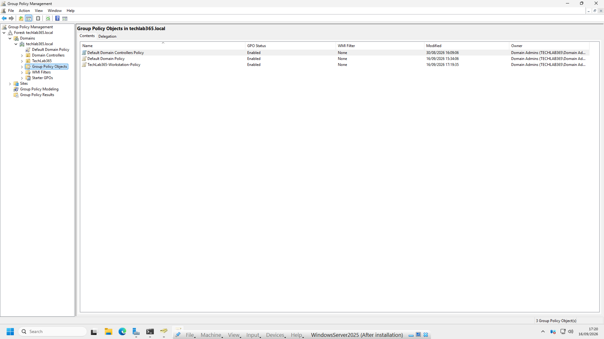
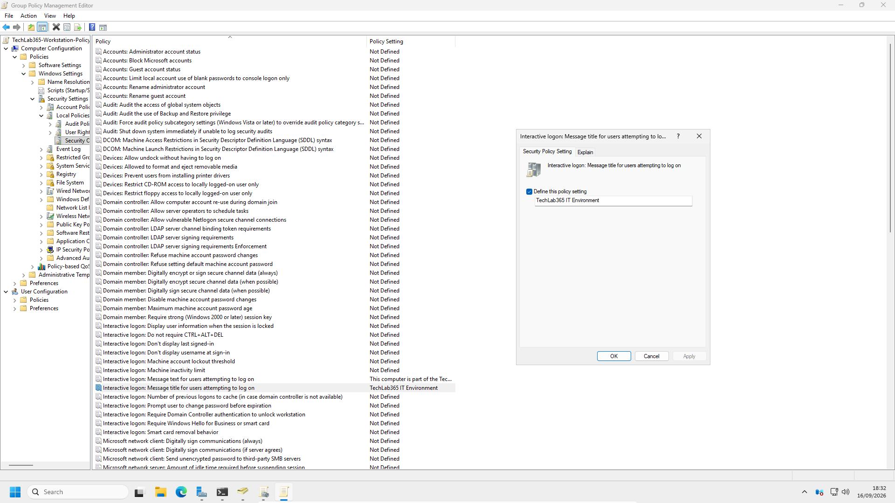
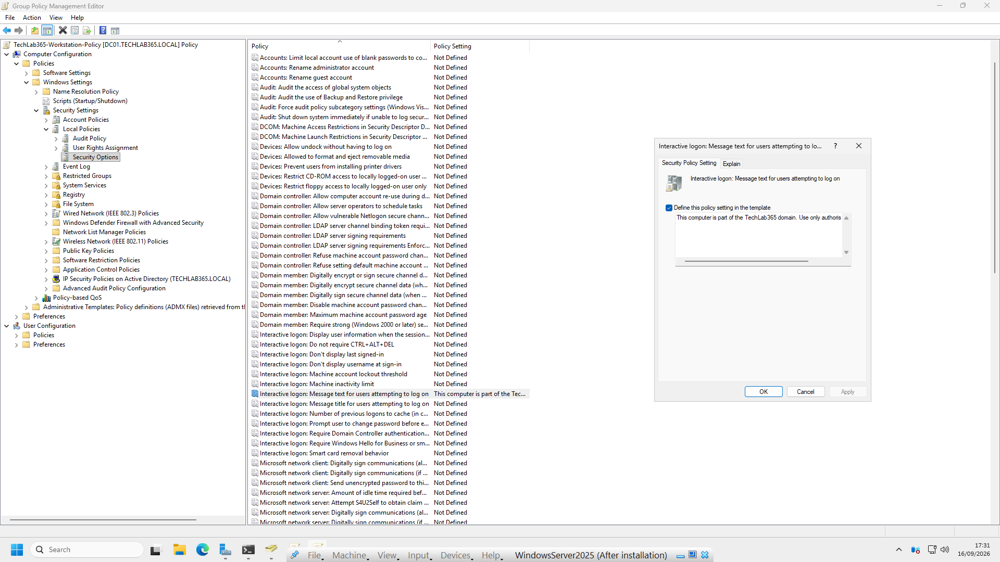
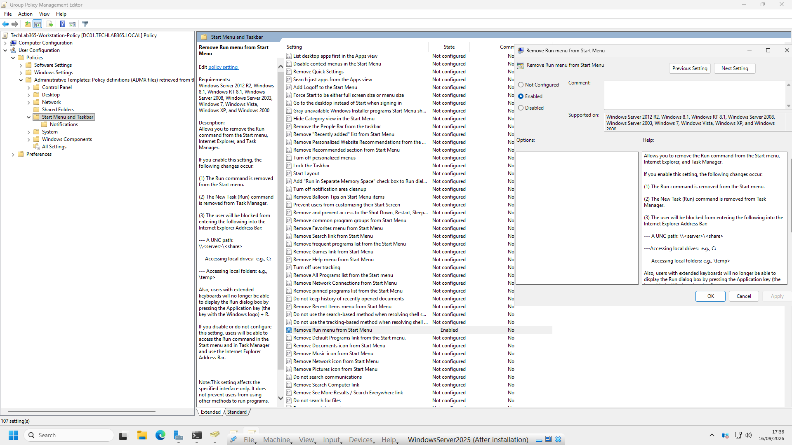
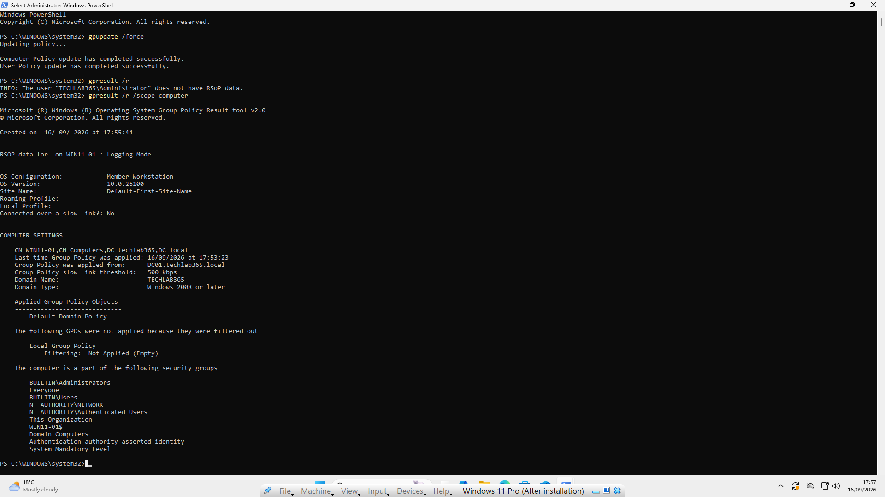
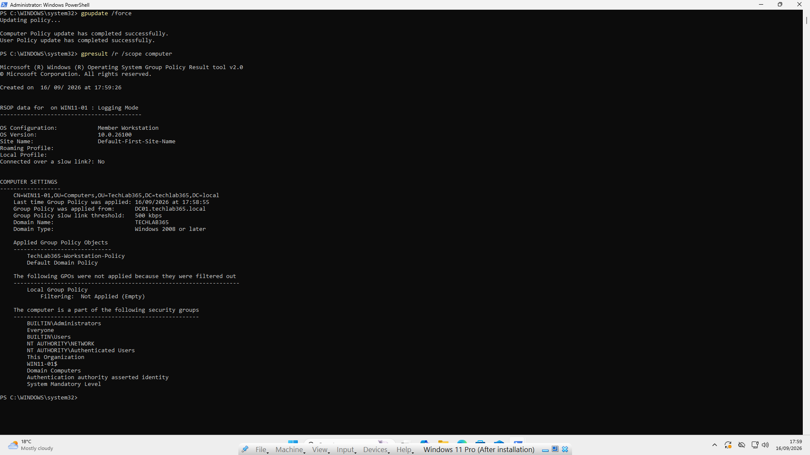
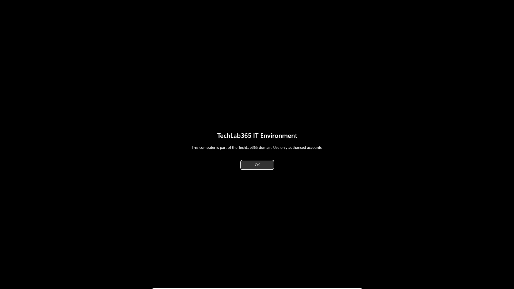
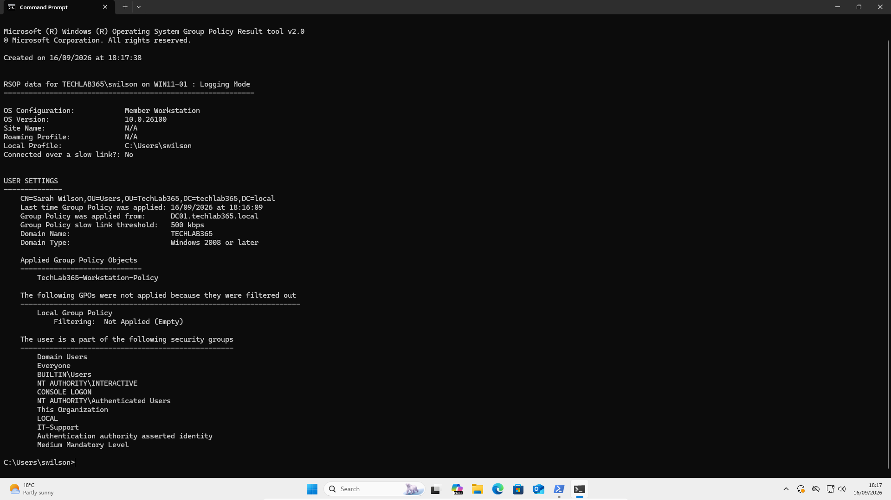
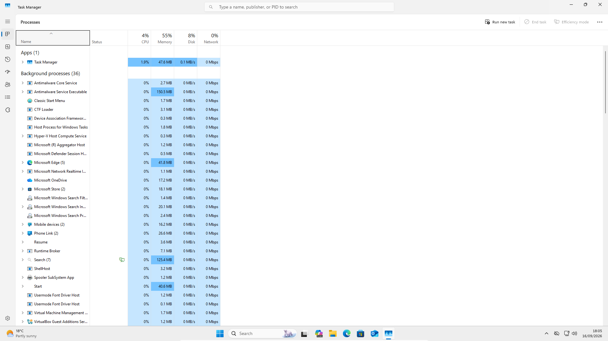
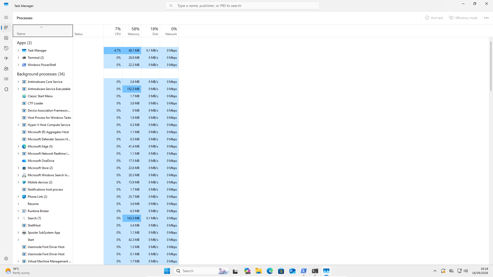

# Group Policy

## Introduction

With the `techlab365.local` Active Directory environment and the domain-joined Windows 11 workstation established, the next stage of the laboratory focuses on **Group Policy**.

Group Policy allows administrators to centrally manage Windows settings instead of configuring each workstation individually. In a business environment, this can be used to apply consistent security, configuration and user-experience settings across computers and users.

For this laboratory, **Group Policy Management** was used to create a dedicated GPO named `TechLab365-Workstation-Policy`. The GPO demonstrates both **Computer Configuration** and **User Configuration** and shows how the location of an Active Directory object affects whether a policy is applied.

The chapter also includes a genuine troubleshooting scenario. The Windows 11 computer initially remained in the default `Computers` container instead of the custom `TechLab365\Computers` OU. As a result, the GPO did not apply. The computer was moved to the correct OU and the policy was then successfully processed.

The final verification was performed on Windows 11 by checking the applied GPO with `gpresult` and confirming the visible effects of the configured policies.

---

# Objectives

After completing this chapter, I will be able to:

- Understand the purpose of Group Policy.
- Understand the difference between a Group Policy Object (GPO) and a GPO link.
- Open and navigate Group Policy Management.
- Understand Computer Configuration and User Configuration.
- Create a Group Policy Object.
- Configure a computer-side security policy.
- Configure a user-side Administrative Template policy.
- Link a GPO to an Organisational Unit.
- Understand why the location of a computer or user object matters.
- Refresh Group Policy on a Windows workstation.
- Use `gpresult` to identify applied GPOs.
- Troubleshoot a GPO that is not being applied.
- Verify the actual effect of a GPO on a domain-joined Windows 11 workstation.

---

# Prerequisites

Before starting this chapter, ensure that:

- Windows Server 2025 has been installed successfully.
- `DC01` has been promoted to a Domain Controller.
- The `techlab365.local` Active Directory domain is operational.
- The `TechLab365` OU structure has been created.
- A `Computers` OU exists under `TechLab365`.
- A `Users` OU exists under `TechLab365`.
- The Windows 11 workstation `WIN11-01` has joined the domain.
- Sarah Wilson (`swilson`) is available as a domain user.
- Group Policy Management is available on the Domain Controller.

The Active Directory infrastructure and domain-joined Windows 11 workstation were completed in the previous chapters.

---

# Lab Configuration

The Group Policy laboratory used the following configuration:

| Component | Configuration |
|---|---|
| Domain Controller | `DC01` |
| Server Operating System | Windows Server 2025 |
| Domain | `techlab365.local` |
| Windows 11 Workstation | `WIN11-01` |
| Windows 11 User | Sarah Wilson (`swilson`) |
| Computer OU | `TechLab365\Computers` |
| User OU | `TechLab365\Users` |
| GPO | `TechLab365-Workstation-Policy` |
| Management Tool | Group Policy Management |

---

# Understanding Group Policy

**Group Policy** provides centralised management of Windows settings in an Active Directory environment.

A **Group Policy Object (GPO)** is a collection of policy settings. Creating a GPO does not by itself determine which users or computers will receive it. The GPO normally needs to be **linked** to an Active Directory site, domain or Organisational Unit.

A GPO contains two main configuration areas:

```text
Computer Configuration
        ↓
Settings applied to computers

User Configuration
        ↓
Settings applied to users
```

This distinction is important when troubleshooting.

A computer-side setting is processed in the context of the computer account. A user-side setting is processed in the context of the user account.

For example, in this laboratory:

```text
TechLab365
   ├── Computers
   │      └── WIN11-01
   │
   └── Users
          └── Sarah Wilson
```

The GPO was linked to the `Computers` OU. The computer object therefore had to be located in that OU for the computer-side settings to be applied.

The user-side settings were also processed for Sarah because her user account was located in the `TechLab365\Users` OU and the GPO's security filtering allowed authenticated users.

---

# Group Policy Management

**Group Policy Management** provides the graphical interface used to create, edit, link and review GPOs.

On the Domain Controller, open **Group Policy Management**.

The main areas used during this chapter were:

- **Group Policy Objects** — contains the GPOs created in the domain.
- **Domain and OU nodes** — show where GPOs are linked.
- **Group Policy Management Editor** — used to configure the settings inside a GPO.
- **Group Policy Results** — can be used to investigate the policies actually applied to a user or computer.

A useful distinction is:

```text
GPO
 ↓
Contains policy settings

GPO Link
 ↓
Determines the Active Directory location where the GPO applies
```

---

# Creating the Workstation GPO

A dedicated GPO named `TechLab365-Workstation-Policy` was created for the laboratory.

In **Group Policy Management**:

1. Expand **Forest: `techlab365.local`**.
2. Expand **Domains**.
3. Expand **`techlab365.local`**.
4. Right-click **Group Policy Objects**.
5. Select **New**.
6. In the **Name** field, enter:
   `TechLab365-Workstation-Policy`
7. Leave **Source Starter GPO** as `(none)`.
8. Click **OK**.

The new GPO then appeared under **Group Policy Objects**.



To configure the settings, right-click `TechLab365-Workstation-Policy` and select **Edit**.

This opens the **Group Policy Management Editor**, where Computer Configuration and User Configuration can be configured independently.

---

# Configuring Computer Configuration

The computer-side configuration used an **Interactive Logon** message.

This is a useful demonstration because the setting is processed by the computer and produces a visible result on the Windows sign-in screen.

The settings are located at:

```text
Computer Configuration
→ Policies
→ Windows Settings
→ Security Settings
→ Local Policies
→ Security Options
```

Two related settings were configured:

```text
Interactive logon: Message title for users attempting to log on

Interactive logon: Message text for users attempting to log on
```

Both settings are required to produce the complete message.

---

## Configuring the Interactive Logon Message Title

In **Group Policy Management Editor**:

1. Expand **Computer Configuration**.
2. Expand **Policies**.
3. Expand **Windows Settings**.
4. Expand **Security Settings**.
5. Expand **Local Policies**.
6. Select **Security Options**.
7. Locate **Interactive logon: Message title for users attempting to log on**.
8. Right-click the setting.
9. Select **Properties**.
10. Select **Define this policy setting**.
11. Enter:

```text
TechLab365 IT Environment
```

12. Click **Apply**.
13. Click **OK**.



The title is the heading displayed on the Windows sign-in screen.

---

## Configuring the Interactive Logon Message Text

The second setting controls the main text displayed below the title.

In **Security Options**:

1. Locate **Interactive logon: Message text for users attempting to log on**.
2. Right-click the setting.
3. Select **Properties**.
4. Select **Define this policy setting**.
5. Enter:

```text
This computer is part of the TechLab365 domain. Use only authorised accounts.
```

6. Click **Apply**.
7. Click **OK**.



The two settings now work together:

```text
Title:
TechLab365 IT Environment

Text:
This computer is part of the TechLab365 domain.
Use only authorised accounts.
```

The title and text were deliberately configured as separate settings because Group Policy provides separate controls for each part of the logon message.

---

# Configuring User Configuration

The user-side configuration was created using an **Administrative Template** policy.

The selected policy was:

```text
Remove Run menu from Start Menu
```

This demonstrates that a GPO can control the Windows user experience without changing the computer configuration.

The setting is located at:

```text
User Configuration
→ Policies
→ Administrative Templates
→ Start Menu and Taskbar
→ Remove Run menu from Start Menu
```

To configure the policy:

1. Expand **User Configuration**.
2. Expand **Policies**.
3. Expand **Administrative Templates**.
4. Select **Start Menu and Taskbar**.
5. Locate **Remove Run menu from Start Menu**.
6. Right-click the setting.
7. Select **Edit**.
8. Select **Enabled**.
9. Click **Apply**.
10. Click **OK**.



The policy is now configured inside the GPO, but it will not affect a workstation until the GPO is linked to an appropriate Active Directory location and the policy is processed by the client.

---

# Linking the GPO to the Computers OU

Creating a GPO and linking a GPO are separate tasks.

The GPO was linked to:

```text
techlab365.local
→ TechLab365
→ Computers
```

In **Group Policy Management**:

1. Expand **`techlab365.local`**.
2. Expand **TechLab365**.
3. Right-click the **Computers** OU.
4. Select **Link an Existing GPO**.
5. Select `TechLab365-Workstation-Policy`.
6. Click **OK**.

The GPO is now linked to the `Computers` OU.

This means the policy can apply to computer objects located in that OU, subject to normal Group Policy processing and security filtering.

---

# Understanding GPO Processing and Inheritance

Group Policy is processed according to the Active Directory hierarchy.

A simplified model is:

```text
Local Group Policy
        ↓
Site
        ↓
Domain
        ↓
Organisational Unit
        ↓
Child Organisational Unit
        ↓
User or Computer
```

Policies applied at higher levels can be inherited by objects further down the hierarchy.

The location of the target object is therefore important.

For example:

```text
techlab365.local
└── TechLab365
    └── Computers
        └── WIN11-01
```

A GPO linked to `TechLab365\Computers` can apply to `WIN11-01` because the computer object is located in that OU.

If `WIN11-01` is instead located in the default domain `Computers` container:

```text
techlab365.local
└── Computers
    └── WIN11-01
```

the GPO linked specifically to `TechLab365\Computers` will not apply to that computer.

This became the cause of the real troubleshooting issue encountered later in the laboratory.

When policies conflict, more specific policy processing can affect the final result. Group Policy troubleshooting should therefore consider both the policy settings and the Active Directory location of the affected object.

---

# Troubleshooting the GPO

## Initial Computer Policy Check

After the GPO was configured and linked, Group Policy was refreshed on Windows 11.

Open **PowerShell as an administrator** and run:

```powershell
gpupdate /force
```

The command reported that both computer and user policy updates completed successfully.

The computer-side policy result was then checked with:

```powershell
gpresult /r /scope computer
```

Initially, the report did **not** show `TechLab365-Workstation-Policy` under **Applied Group Policy Objects**.

The report showed the computer location as:

```text
CN=WIN11-01,CN=Computers,DC=techlab365,DC=local
```

This was the important evidence.

The GPO was linked to:

```text
OU=Computers,OU=TechLab365,DC=techlab365,DC=local
```

but `WIN11-01` was still located in the default `Computers` container.



The problem was therefore not initially the policy configuration. The target computer was simply in the wrong Active Directory location.

---

## Moving WIN11-01 to the Correct OU

The computer object was moved using **Active Directory Users and Computers**.

1. Open **Active Directory Users and Computers**.
2. Expand `techlab365.local`.
3. Locate the default **Computers** container.
4. Right-click `WIN11-01`.
5. Select **Move**.
6. In the destination tree, expand **TechLab365**.
7. Select **Computers**.
8. Click **OK**.

The computer was now located at:

```text
CN=WIN11-01,OU=Computers,OU=TechLab365,DC=techlab365,DC=local
```

This placed the computer in the OU to which `TechLab365-Workstation-Policy` was linked.

---

# Refreshing and Verifying Computer Policy

After moving the computer, the policy was refreshed again.

On Windows 11, open **PowerShell** as an administrator.

### Command 1

```powershell
gpupdate /force
```

Wait for the message confirming that the computer policy update has completed successfully.

### Command 2

```powershell
gpresult /r /scope computer
```

The resulting report showed the computer in the correct OU:

```text
CN=WIN11-01,OU=Computers,OU=TechLab365,DC=techlab365,DC=local
```

Under **Applied Group Policy Objects**, the report now showed:

```text
TechLab365-Workstation-Policy
Default Domain Policy
```



This provided command-line evidence that the custom GPO was now being processed by `WIN11-01`.

---

# Verifying the Computer Policy Effect

The configured Interactive Logon policy was then verified directly on Windows 11.

1. Sign out of the Windows 11 workstation.
2. Wait for the Windows sign-in screen to appear.
3. Confirm that the configured message is displayed.

The screen showed:

```text
TechLab365 IT Environment

This computer is part of the TechLab365 domain. Use only authorised accounts.
```



This provided direct client-side evidence that the computer configuration had not only been applied according to `gpresult`, but had also produced the expected Windows behaviour.

---

# Verifying User Configuration

The user-side policy was verified while logged into Windows 11 as **Sarah Wilson**.

First confirm the current identity:

```cmd
whoami
```

The result was:

```text
techlab365\swilson
```

The user policy was then refreshed.

### Command 1

```cmd
gpupdate /force
```

### Command 2

```cmd
gpresult /r /scope user
```

The report showed Sarah's Active Directory location:

```text
CN=Sarah Wilson,OU=Users,OU=TechLab365,DC=techlab365,DC=local
```

The applied policy section showed:

```text
TechLab365-Workstation-Policy
```



This confirmed that the GPO was also being processed in Sarah Wilson's user context.

---

# Troubleshooting User Policy Verification

During the verification process, an initial user-policy check did not provide the expected RSoP information.

The important troubleshooting point was to check **which account was actually logged in** before interpreting the result.

A `gpresult` command run while logged in as the local/domain Administrator did not provide Sarah Wilson's user RSoP data.

The correct test was therefore performed after signing in as:

```text
techlab365\swilson
```

The user policy was then refreshed and checked with:

```cmd
gpresult /r /scope user
```

This produced the expected user-side policy information for Sarah Wilson.



The later successful result confirmed:

```text
TECHLAB365\swilson
```

and:

```text
TechLab365-Workstation-Policy
```

under the applied user policies.

The lesson is that `gpresult /scope user` reports the user context of the account currently being examined. It should not be interpreted as Sarah Wilson's policy result when another account is logged in.

---

# Verifying the User Policy Effect

The final test checked the actual Windows behaviour produced by the user policy.

The configured policy was:

```text
Remove Run menu from Start Menu
```

After Group Policy processing, the **Run** option was no longer available from the Start menu.



This provided direct evidence that the User Configuration setting was being enforced on the Windows 11 client.

---

# Group Policy Troubleshooting Method

The troubleshooting performed in this laboratory demonstrates a useful general process for investigating a GPO that does not appear to work.

### Step 1 - Confirm the GPO exists

In **Group Policy Management**:

1. Expand `techlab365.local`.
2. Select **Group Policy Objects**.
3. Confirm that the required GPO exists.

### Step 2 - Confirm the GPO is linked

1. Expand the relevant OU.
2. Select the OU.
3. Check the **Linked Group Policy Objects** section.
4. Confirm that `TechLab365-Workstation-Policy` is listed.

### Step 3 - Check the target object's location

For a computer policy:

1. Open **Active Directory Users and Computers**.
2. Locate the computer account.
3. Check which OU or container contains it.

For a user policy, perform the same check for the user account.

### Step 4 - Refresh Group Policy

On the Windows client:

```powershell
gpupdate /force
```

### Step 5 - Check the applied GPOs

For computer policy:

```powershell
gpresult /r /scope computer
```

For user policy:

```powershell
gpresult /r /scope user
```

### Step 6 - Check the actual Windows effect

If the GPO appears under **Applied Group Policy Objects**, verify the actual setting or behaviour on the client.

This sequence can be remembered as:

```text
GPO exists
    ↓
GPO linked
    ↓
Target object in correct OU
    ↓
gpupdate /force
    ↓
gpresult
    ↓
Verify actual Windows effect
```

The laboratory demonstrated why this sequence is useful: the GPO itself was correctly configured, but the computer was initially in the wrong Active Directory container.

---

# Verification

The Group Policy administration tasks were considered successful after confirming that:

- The `TechLab365-Workstation-Policy` GPO was created.
- The GPO was visible under **Group Policy Objects**.
- Computer Configuration was configured with an Interactive Logon message title.
- Computer Configuration was configured with an Interactive Logon message text.
- User Configuration was configured with **Remove Run menu from Start Menu**.
- The GPO was linked to the `TechLab365\Computers` OU.
- The `WIN11-01` computer object was identified in the wrong default `Computers` container during troubleshooting.
- `WIN11-01` was moved to the `TechLab365\Computers` OU.
- `gpupdate /force` completed successfully.
- `gpresult /r /scope computer` showed `TechLab365-Workstation-Policy` as applied.
- The computer-side Interactive Logon message was displayed on Windows 11.
- Sarah Wilson's user account was confirmed with `whoami`.
- `gpresult /r /scope user` showed `TechLab365-Workstation-Policy` as applied for Sarah Wilson.
- The Run option was removed from the Windows 11 Start menu.

The final verification demonstrated both policy processing and the actual client-side effects of the configured policies.

---

# Key Learnings

During this chapter, I learned that:

- Group Policy provides centralised management of Windows settings.
- A GPO is a collection of policy settings, while a GPO link determines where those settings can apply.
- Computer Configuration and User Configuration operate in different security contexts.
- The location of a user or computer object within Active Directory can determine whether a GPO applies.
- A computer in the default `Computers` container is different from a computer in a custom `Computers` OU.
- `gpupdate /force` can be used to request an immediate Group Policy refresh.
- `gpresult` can show which GPOs have actually been applied.
- `gpresult /scope computer` should be used when investigating computer-side policy.
- `gpresult /scope user` should be used while logged in as the user whose policy is being investigated.
- A successful `gpupdate` does not by itself prove that the required GPO was applied.
- The actual Windows behaviour should also be checked after policy processing.
- Computer-side and user-side policies can be configured independently inside the same GPO.
- Group Policy troubleshooting should begin with evidence rather than assumptions.
- Checking the target object's Active Directory location is an important troubleshooting step.
- A correctly configured GPO can appear not to work simply because the target object is outside the OU where the GPO is linked.
- GPO verification is stronger when both `gpresult` output and the actual client-side effect are checked.

---

# Skills Demonstrated

During this chapter, I demonstrated practical experience in:

- Group Policy Management.
- Group Policy Object creation.
- GPO configuration.
- GPO linking to an Organisational Unit.
- Computer Configuration.
- User Configuration.
- Administrative Templates.
- Windows Security Options.
- Interactive Windows logon policy configuration.
- Active Directory OU administration.
- Moving computer objects between Active Directory containers and OUs.
- `gpupdate`.
- `gpresult`.
- Computer-side Group Policy verification.
- User-side Group Policy verification.
- Group Policy troubleshooting.
- Client-side policy verification.
- Windows 11 domain administration.
- First Line IT Support troubleshooting methodology.
- Technical documentation using GitHub and Markdown.

---

# Interview Tip

For a First Line or Service Desk role, a useful way to describe this practical experience is:

> "I created and administered a Group Policy Object in my Windows Server 2025 Active Directory lab. I configured both Computer Configuration and User Configuration, linked the GPO to an OU, and used `gpupdate` and `gpresult` to verify policy processing. I also troubleshot a real issue where the workstation was in the default Computers container instead of the OU where the GPO was linked, moved the computer to the correct OU and then verified the policy effects on Windows 11."

This demonstrates practical Group Policy administration together with a structured troubleshooting approach.

---

# Chapter Summary

In this chapter, Group Policy was used to centrally manage settings in the `techlab365.local` Active Directory environment.

A dedicated `TechLab365-Workstation-Policy` GPO was created and configured with both computer and user settings. Computer Configuration was used to create an Interactive Logon message, while User Configuration was used to remove the Run menu from the Windows 11 Start menu.

The GPO was linked to the `TechLab365\Computers` OU. During verification, `gpresult` showed that `WIN11-01` was initially located in the default `Computers` container. Because the GPO was linked to the custom OU, the policy was not applied.

The computer object was moved to the correct OU and Group Policy was refreshed with `gpupdate /force`. `gpresult /r /scope computer` then confirmed that `TechLab365-Workstation-Policy` was applied.

The computer-side policy was verified by displaying the Interactive Logon message on Windows 11. The user-side policy was verified while logged in as Sarah Wilson, and `gpresult /r /scope user` confirmed that the GPO was applied in her user context. The removal of the Run menu provided the final client-side verification.

The chapter therefore demonstrates the complete Group Policy workflow:

```text
Create
  ↓
Configure
  ↓
Link
  ↓
Place target object correctly
  ↓
Refresh
  ↓
Verify applied policy
  ↓
Verify actual client effect
  ↓
Troubleshoot when necessary
```

The Active Directory environment is now ready for the next stage of the laboratory: DNS administration.

---

# Next Chapter

Continue directly to:

**[Chapter 10 – DNS Administration](../10-DNS-Administration/DNS-Administration.md)**
